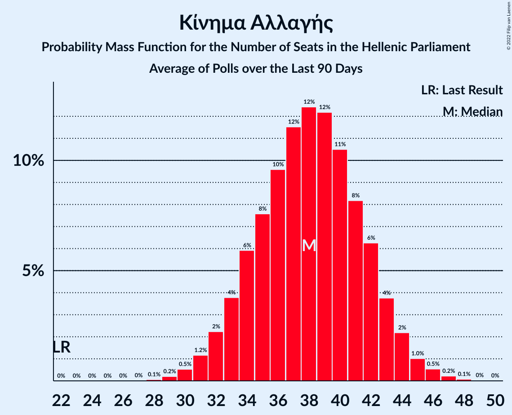

# Κίνημα Αλλαγής

<a href="#voting-intentions">Voting Intentions</a> | <a href="#seats">Seats</a>

## Voting Intentions

Last result: **8.1%** (General Election of 7 July 2019)

### Confidence Intervals

| Period     | Polling firm/Commissioner(s) | Median | 80% Confidence Interval | 90% Confidence Interval | 95% Confidence Interval | 99% Confidence Interval |
|:----------:|:----------------:|:-----------:|:-----------------------:|:-----------------------:|:-----------------------:|:-----------------------:|
| N/A | [Poll Average](average.html) | 7.8% | 6.7–9.0% | 6.3–9.4% | 6.1–9.7% | 5.6–10.4% |
| [10–12 April 2021](2021-04-12-GPO.html) | GPO   powergame.gr | 8.3% | 7.3–9.5% | 7.0–9.9% | 6.7–10.2% | 6.3–10.8% |
| [8–9 April 2021](2021-04-09-Prorata.html) | Prorata   Η Εφημερίδα των Συντακτών | 7.5% | 6.5–8.7% | 6.2–9.0% | 6.0–9.3% | 5.6–9.9% |
| [26–28 March 2021](2021-03-28-PulseRC.html) | Pulse RC   ΣΚΑΪ | 7.8% | 6.9–8.9% | 6.7–9.1% | 6.5–9.4% | 6.1–9.9% |
| [17–23 March 2021](2021-03-23-MetronAnalysis.html) | Metron Analysis   Mega | 8.1% | 7.1–9.3% | 6.8–9.7% | 6.6–10.0% | 6.1–10.6% |
| [19–22 March 2021](2021-03-22-Marc.html) | Marc   Alpha TV | 8.1% | 7.1–9.3% | 6.8–9.6% | 6.5–9.9% | 6.1–10.5% |
| [17–22 March 2021](2021-03-22-Interview.html) | Interview   Βεργίνα TV | 7.5% | 6.5–8.7% | 6.2–9.0% | 6.0–9.3% | 5.6–9.9% |
| [14–18 March 2021](2021-03-18-Alco.html) | Alco   Open TV | 7.0% | 6.1–8.2% | 5.8–8.5% | 5.6–8.8% | 5.2–9.3% |
| [3–5 March 2021](2021-03-05-GPO.html) | GPO   Τα Νέα | 8.5% | 7.5–9.7% | 7.2–10.1% | 6.9–10.4% | 6.4–11.0% |
| [1–3 March 2021](2021-03-03-MRB.html) | MRB   Star | 7.2% | 6.2–8.4% | 6.0–8.7% | 5.7–9.0% | 5.3–9.6% |
| [26–28 February 2021](2021-02-28-PulseRC.html) | Pulse RC   ΣΚΑΪ | 8.5% | 7.6–9.6% | 7.3–9.9% | 7.1–10.2% | 6.7–10.7% |
| [22–27 February 2021](2021-02-27-MetronAnalysis.html) | Metron Analysis   Mega | 8.2% | 7.3–9.3% | 7.0–9.6% | 6.8–9.9% | 6.4–10.5% |
| [23–26 February 2021](2021-02-26-Prorata.html) | Prorata   Η Εφημερίδα των Συντακτών | 7.0% | 6.1–8.2% | 5.8–8.5% | 5.6–8.8% | 5.2–9.3% |
| [22–26 February 2021](2021-02-26-OpinionPoll.html) | Opinion Poll   Political | 8.4% | 7.4–9.6% | 7.1–10.0% | 6.8–10.3% | 6.4–10.9% |
| [20–24 February 2021](2021-02-24-ΚάπαResearch.html) | Κάπα Research | 7.4% | 6.7–8.2% | 6.5–8.5% | 6.4–8.7% | 6.0–9.1% |
| [15–19 February 2021](2021-02-19-OpinionPoll.html) | Opinion Poll   Political | 8.8% | 7.7–10.0% | 7.4–10.4% | 7.2–10.7% | 6.7–11.3% |
| [15–18 February 2021](2021-02-18-Alco.html) | Alco   Open TV | 7.5% | 6.5–8.7% | 6.2–9.0% | 6.0–9.3% | 5.6–9.9% |
| [15–17 February 2021](2021-02-17-Interview.html) | Interview   Βεργίνα TV | 9.1% | 8.0–10.4% | 7.7–10.7% | 7.5–11.1% | 7.0–11.7% |
| [25–27 January 2021](2021-01-27-PulseRC.html) | Pulse RC   ΣΚΑΪ | 8.0% | 7.2–8.9% | 7.0–9.1% | 6.8–9.4% | 6.4–9.8% |
| [19–25 January 2021](2021-01-25-MetronAnalysis.html) | Metron Analysis   Mega | 8.2% | 7.2–9.3% | 7.0–9.6% | 6.7–9.9% | 6.3–10.4% |
| [19–22 January 2021](2021-01-22-GPO.html) | GPO   Παραπολιτικά | 7.3% | 6.3–8.5% | 6.1–8.8% | 5.8–9.1% | 5.4–9.7% |
| [14–19 January 2021](2021-01-19-Alco.html) | Alco   Open TV | 6.7% | 5.8–7.8% | 5.5–8.2% | 5.3–8.4% | 4.9–9.0% |
| [7–16 January 2021](2021-01-16-ToThePoint.html) | To The Point   Voria.gr | 6.7% | 5.8–8.0% | 5.5–8.3% | 5.3–8.6% | 4.8–9.2% |
| [7–11 January 2021](2021-01-11-Marc.html) | Marc   Αlpha TV | 8.1% | 7.1–9.3% | 6.8–9.7% | 6.6–10.0% | 6.1–10.6% |
| [4–8 January 2021](2021-01-08-OpinionPoll.html) | Opinion Poll | 8.1% | 7.1–9.3% | 6.8–9.6% | 6.5–9.9% | 6.1–10.5% |
| [12–16 December 2020](2020-12-16-PulseRC.html) | Pulse RC   ΣΚΑΪ | 7.7% | 6.8–8.7% | 6.6–9.0% | 6.4–9.3% | 6.0–9.8% |
| [27–11 December 2020](2020-12-11-MRB.html) | MRB   Star | 7.9% | 7.0–9.0% | 6.7–9.3% | 6.5–9.6% | 6.1–10.2% |
| [3–9 December 2020](2020-12-09-Alco.html) | Alco   Open TV | 8.0% | 7.0–9.2% | 6.7–9.6% | 6.5–9.9% | 6.0–10.5% |
| [3–7 December 2020](2020-12-07-Interview.html) | Interview   Βεργίνα TV | 8.0% | 7.0–9.1% | 6.8–9.4% | 6.6–9.6% | 6.1–10.2% |
| [26 November–2 December 2020](2020-12-02-Interview.html) | Interview   Βεργίνα TV | 8.0% | 7.0–9.1% | 6.8–9.5% | 6.5–9.8% | 6.1–10.3% |
| [24–27 November 2020](2020-11-27-Prorata.html) | Prorata | 6.1% | 5.5–6.7% | 5.4–6.9% | 5.2–7.1% | 5.0–7.4% |
| [24–26 November 2020](2020-11-26-PulseRC.html) | Pulse RC   ΣΚΑΪ | 7.5% | 6.6–8.5% | 6.4–8.8% | 6.2–9.0% | 5.8–9.5% |
| [18–24 November 2020](2020-11-24-MetronAnalysis.html) | Metron Analysis   MEGA TV | 8.0% | 7.0–9.1% | 6.8–9.4% | 6.6–9.6% | 6.1–10.2% |
| [22–24 November 2020](2020-11-24-MRB.html) | MRB   Star | 7.1% | 6.1–8.2% | 5.9–8.6% | 5.6–8.8% | 5.2–9.4% |
| [17–19 November 2020](2020-11-19-ΚάπαResearch.html) | Κάπα Research | 7.3% | 6.4–8.4% | 6.1–8.8% | 5.9–9.0% | 5.5–9.6% |
| [10–13 November 2020](2020-11-13-GPO.html) | GPO   Παραπολιτικά | 7.6% | 6.6–8.8% | 6.3–9.1% | 6.1–9.4% | 5.7–10.0% |
| [4–11 November 2020](2020-11-11-OpinionPoll.html) | Opinion Poll | 8.4% | 7.4–9.6% | 7.1–10.0% | 6.8–10.3% | 6.4–10.9% |
| [6–11 November 2020](2020-11-11-Alco.html) | Alco   Open TV | 8.3% | 7.3–9.5% | 7.0–9.9% | 6.7–10.2% | 6.3–10.8% |
| [26–28 October 2020](2020-10-28-GPO.html) | GPO   Action24 | 8.3% | 7.3–9.5% | 7.0–9.9% | 6.7–10.2% | 6.3–10.8% |
| [18–22 October 2020](2020-10-22-PulseRC.html) | Pulse RC   ΣΚΑΪ | 7.6% | 6.6–8.8% | 6.3–9.1% | 6.1–9.4% | 5.7–10.0% |
| [16–21 October 2020](2020-10-21-Interview.html) | Interview   Βεργίνα TV | 8.4% | 7.4–9.5% | 7.1–9.8% | 6.9–10.1% | 6.5–10.6% |
| [11–15 October 2020](2020-10-15-OpinionPoll.html) | Opinion Poll | 8.8% | 7.7–10.1% | 7.4–10.4% | 7.2–10.7% | 6.7–11.4% |
| [10–14 October 2020](2020-10-14-Marc.html) | Marc   Αlpha TV | 8.1% | 7.1–9.4% | 6.8–9.7% | 6.6–10.0% | 6.1–10.6% |
| [6–10 October 2020](2020-10-10-Alco.html) | Alco   Open TV | 7.5% | 6.5–8.7% | 6.2–9.0% | 6.0–9.3% | 5.6–9.9% |
| [23–29 September 2020](2020-09-29-MetronAnalysis.html) | Metron Analysis   MEGA TV | 6.9% | 6.1–7.9% | 5.8–8.2% | 5.6–8.5% | 5.2–9.0% |
| [22–23 September 2020](2020-09-23-PulseRC.html) | Pulse RC   ΣΚΑΪ | 7.5% | 6.6–8.5% | 6.4–8.8% | 6.2–9.1% | 5.8–9.6% |
| [21–23 September 2020](2020-09-23-MRB.html) | MRB   Star | 6.2% | 5.4–7.3% | 5.1–7.7% | 4.9–7.9% | 4.5–8.5% |
| [21–23 September 2020](2020-09-23-Interview.html) | Interview   Βεργίνα TV | 8.6% | 7.6–9.8% | 7.4–10.2% | 7.1–10.4% | 6.7–11.0% |
| [14–16 September 2020](2020-09-16-GPO.html) | GPO   Παραπολιτικά | 8.1% | 7.1–9.3% | 6.8–9.7% | 6.6–10.0% | 6.1–10.6% |
| [14–16 September 2020](2020-09-16-Alco.html) | Alco   Open TV | 7.8% | 6.8–9.0% | 6.5–9.3% | 6.3–9.6% | 5.8–10.2% |
| [10–12 September 2020](2020-09-12-Marc.html) | Marc   Πρώτο ΘΕΜΑ | 8.0% | 7.2–8.9% | 6.9–9.2% | 6.7–9.5% | 6.4–9.9% |
| [7–10 September 2020](2020-09-10-OpinionPoll.html) | Opinion Poll | 7.4% | 6.4–8.6% | 6.1–8.9% | 5.9–9.2% | 5.5–9.8% |
| [30 August–2 September 2020](2020-09-02-GPO.html) | GPO   Τα Νέα | 8.3% | 7.3–9.5% | 7.0–9.9% | 6.7–10.2% | 6.3–10.8% |
| [13–15 July 2020](2020-07-15-Interview.html) | Interview   Βεργίνα TV | 7.4% | 6.4–8.5% | 6.2–8.8% | 6.0–9.1% | 5.6–9.6% |
| [10–13 July 2020](2020-07-13-Marc.html) | Marc   Αlpha TV | 6.9% | 5.9–8.0% | 5.7–8.3% | 5.5–8.6% | 5.0–9.2% |
| [6–8 July 2020](2020-07-08-PulseRC.html) | Pulse RC   ΣΚΑΪ | 7.0% | 6.1–8.0% | 5.9–8.2% | 5.7–8.5% | 5.3–9.0% |
| [29 June–4 July 2020](2020-07-04-Alco.html) | Alco   Open TV | 6.9% | 6.0–8.0% | 5.7–8.4% | 5.5–8.7% | 5.1–9.2% |
| [1–3 July 2020](2020-07-03-OpinionPoll.html) | Opinion Poll | 6.9% | 6.0–8.0% | 5.8–8.3% | 5.5–8.6% | 5.2–9.1% |
| [2 July 2020](2020-07-02-ΚάπαResearch.html) | Κάπα Research | 6.5% | 5.6–7.6% | 5.3–7.9% | 5.1–8.2% | 4.7–8.8% |
| [1–2 July 2020](2020-07-02-Marc.html) | Marc | 7.0% | 6.3–7.8% | 6.1–8.0% | 6.0–8.2% | 5.6–8.6% |
| [24–29 June 2020](2020-06-29-MetronAnalysis.html) | Metron Analysis   Το Βήμα | 7.0% | 6.2–8.0% | 5.9–8.2% | 5.8–8.5% | 5.4–8.9% |
| [22–26 June 2020](2020-06-26-Prorata.html) | Prorata | 6.0% | 5.4–6.7% | 5.2–6.9% | 5.1–7.1% | 4.8–7.4% |
| [22–26 June 2020](2020-06-26-GPO.html) | GPO   Τα Νέα | 7.0% | 6.2–7.9% | 6.0–8.2% | 5.8–8.4% | 5.5–8.9% |
| [17–25 June 2020](2020-06-25-MRB.html) | MRB   Star | 7.6% | 6.9–8.4% | 6.7–8.6% | 6.6–8.8% | 6.2–9.2% |
| [4–9 June 2020](2020-06-09-Interview.html) | Interview   Βεργίνα TV | 7.7% | 6.8–8.9% | 6.5–9.2% | 6.3–9.5% | 5.9–10.0% |
| [2–8 June 2020](2020-06-08-Alco.html) | Alco   Open TV | 7.4% | 6.4–8.6% | 6.2–8.9% | 5.9–9.2% | 5.5–9.8% |
| [1–3 June 2020](2020-06-03-PulseRC.html) | Pulse RC   ΣΚΑΪ | 6.5% | 5.7–7.5% | 5.5–7.8% | 5.3–8.1% | 4.9–8.6% |
| [1–3 June 2020](2020-06-03-OpinionPoll.html) | Opinion Poll   paraskhnio.gr | 6.4% | 5.5–7.5% | 5.3–7.8% | 5.1–8.1% | 4.7–8.6% |
| [22–27 May 2020](2020-05-27-MetronAnalysis.html) | Metron Analysis   MEGA TV | 6.3% | 5.5–7.3% | 5.3–7.6% | 5.1–7.9% | 4.7–8.4% |
| [22–27 May 2020](2020-05-27-GPO.html) | GPO   Παραπολιτικά | 7.2% | 6.2–8.4% | 6.0–8.7% | 5.7–9.0% | 5.3–9.6% |
| [8–13 May 2020](2020-05-13-MRB.html) | MRB   Star | 6.2% | 5.4–7.2% | 5.2–7.4% | 5.0–7.7% | 4.6–8.2% |
| [5–10 May 2020](2020-05-10-Alco.html) | Alco   Open TV | 6.8% | 5.9–7.9% | 5.6–8.3% | 5.4–8.5% | 5.0–9.1% |
| [7–9 May 2020](2020-05-09-OpinionPoll.html) | Opinion Poll | 5.6% | 4.8–6.6% | 4.5–6.8% | 4.3–7.1% | 4.0–7.6% |
| [4–6 May 2020](2020-05-06-PulseRC.html) | Pulse RC   ΣΚΑΪ | 7.0% | 6.1–8.0% | 5.9–8.3% | 5.7–8.6% | 5.3–9.1% |
| [3–6 May 2020](2020-05-06-Interview.html) | Interview   Βεργίνα TV | 7.4% | 6.5–8.5% | 6.2–8.9% | 6.0–9.1% | 5.6–9.7% |
| [24–29 April 2020](2020-04-29-Prorata.html) | Prorata | 6.0% | 5.4–6.7% | 5.3–6.8% | 5.1–7.0% | 4.9–7.3% |
| [22–28 April 2020](2020-04-28-MetronAnalysis.html) | Metron Analysis   MEGA TV | 5.9% | 5.1–6.9% | 4.9–7.1% | 4.7–7.4% | 4.3–7.9% |
| [14–22 April 2020](2020-04-22-GPO.html) | GPO   Παραπολιτικά | 7.3% | 6.3–8.5% | 6.1–8.8% | 5.8–9.1% | 5.4–9.7% |
| [15–17 April 2020](2020-04-17-ΚάπαResearch.html) | Κάπα Research   ΕΘΝΟΣ | 5.9% | 5.1–7.0% | 4.9–7.3% | 4.7–7.5% | 4.3–8.1% |
| [11–13 April 2020](2020-04-13-Marc.html) | Marc   Alpha TV | 6.5% | 5.6–7.6% | 5.3–7.9% | 5.1–8.2% | 4.7–8.7% |
| [30 March–1 April 2020](2020-04-01-PulseRC.html) | Pulse RC   ΣΚΑΪ | 6.0% | 5.2–7.0% | 5.0–7.2% | 4.8–7.5% | 4.5–7.9% |
| [23–26 March 2020](2020-03-26-OpinionPoll.html) | Opinion Poll   Πρώτο ΘΕΜΑ | 6.3% | 5.4–7.3% | 5.2–7.7% | 5.0–7.9% | 4.6–8.4% |
| [6–7 March 2020](2020-03-07-OpinionPoll.html) | Opinion Poll   Πρώτο ΘΕΜΑ | 5.7% | 4.9–6.6% | 4.7–6.9% | 4.5–7.1% | 4.1–7.6% |
| [2–7 March 2020](2020-03-07-Alco.html) | Alco   Open TV | 7.2% | 6.2–8.4% | 6.0–8.7% | 5.7–9.0% | 5.3–9.6% |
| [3–4 March 2020](2020-03-04-PulseRC.html) | Pulse RC   ΣΚΑΪ | 7.5% | 6.6–8.5% | 6.4–8.8% | 6.1–9.1% | 5.7–9.6% |
| [22–27 January 2020](2020-01-27-OpinionPoll.html) | Opinion Poll | 6.3% | 5.4–7.3% | 5.2–7.6% | 5.0–7.9% | 4.6–8.4% |
| [21–22 January 2020](2020-01-22-PulseRC.html) | Pulse RC   ΣΚΑΪ | 7.5% | 6.6–8.6% | 6.4–8.9% | 6.2–9.2% | 5.8–9.7% |
| [20–22 January 2020](2020-01-22-MetronAnalysis.html) | Metron Analysis   Το Βήμα | 7.1% | 6.2–8.1% | 5.9–8.4% | 5.7–8.7% | 5.3–9.2% |
| [13–17 January 2020](2020-01-17-MRB.html) | MRB   Star | 7.5% | 6.7–8.5% | 6.5–8.8% | 6.3–9.0% | 5.9–9.5% |
| [7–8 January 2020](2020-01-08-Interview.html) | Interview   Βεργίνα TV | 5.4% | 4.6–6.4% | 4.3–6.7% | 4.1–7.0% | 3.8–7.5% |
| [16–18 December 2019](2019-12-18-PulseRC.html) | Pulse RC   ΣΚΑΪ | 7.5% | 6.6–8.6% | 6.3–8.9% | 6.1–9.1% | 5.7–9.7% |
| [27 November–5 December 2019](2019-12-05-MRB.html) | MRB   Star | 8.7% | 7.9–9.6% | 7.7–9.8% | 7.5–10.0% | 7.2–10.5% |
| [25–28 November 2019](2019-11-28-OpinionPoll.html) | Opinion Poll | 6.4% | 5.5–7.5% | 5.3–7.8% | 5.1–8.1% | 4.7–8.6% |
| [18–20 November 2019](2019-11-20-ΜetronAnalysis.html) | Μetron Analysis   Το Βήμα | 7.5% | 6.6–8.6% | 6.3–8.9% | 6.1–9.1% | 5.7–9.6% |
| [18–20 November 2019](2019-11-20-PulseRC.html) | Pulse RC   ΣΚΑΪ | 6.9% | 6.1–8.0% | 5.8–8.3% | 5.6–8.5% | 5.2–9.0% |
| [11–14 November 2019](2019-11-14-PalmosAnalysis.html) | Palmos Analysis   GUE–NGL | 6.4% | 5.5–7.5% | 5.3–7.8% | 5.1–8.1% | 4.7–8.7% |
| [29–31 October 2019](2019-10-31-Marc.html) | Marc   Πρώτο ΘΕΜΑ | 6.7% | 5.8–7.8% | 5.5–8.1% | 5.3–8.4% | 4.9–9.0% |
| [22–23 October 2019](2019-10-23-PulseRC.html) | Pulse RC   ΣΚΑΪ | 7.0% | 6.1–8.1% | 5.8–8.4% | 5.6–8.6% | 5.2–9.2% |
| [16–18 September 2019](2019-09-18-ΜetronAnalysis.html) | Μetron Analysis   Το Βήμα | 7.1% | 6.2–8.1% | 6.0–8.4% | 5.7–8.7% | 5.4–9.2% |
| [17–18 September 2019](2019-09-18-PulseRC.html) | Pulse RC   ΣΚΑΪ | 7.0% | 6.1–8.1% | 5.9–8.4% | 5.7–8.7% | 5.3–9.2% |
| [14–16 September 2019](2019-09-16-MRB.html) | MRB   Star | 7.8% | 6.9–9.0% | 6.6–9.4% | 6.3–9.7% | 5.9–10.3% |
| [2–5 September 2019](2019-09-05-Marc.html) | Marc   Πρώτο ΘΕΜΑ | 7.4% | 6.4–8.6% | 6.2–8.9% | 5.9–9.2% | 5.5–9.8% |
| [2–4 September 2019](2019-09-04-OpinionPoll.html) | Opinion Poll | 6.2% | 5.3–7.2% | 5.1–7.5% | 4.9–7.8% | 4.5–8.3% |

### Probability Mass Function

The following table shows the probability mass function per percentage block of voting intentions for the [poll average](average.html) for Κίνημα Αλλαγής.

| Voting Intentions | Probability | Accumulated | Special Marks |
|:-----------------:|:-----------:|:-----------:|:-------------:|
| 3.5–4.5% | 0% | 100% |  |
| 4.5–5.5% | 0.5% | 100% |  |
| 5.5–6.5% | 8% | 99.5% |  |
| 6.5–7.5% | 30% | 92% |  |
| 7.5–8.5% | 40% | 61% | Last Result, Median |
| 8.5–9.5% | 18% | 22% |  |
| 9.5–10.5% | 3% | 4% |  |
| 10.5–11.5% | 0.3% | 0.3% |  |
| 11.5–12.5% | 0% | 0% |  |

## Seats

Last result: **22** seats (General Election of 7 July 2019)

### Confidence Intervals

| Period     | Polling firm/Commissioner(s) | Median | 80% Confidence Interval | 90% Confidence Interval | 95% Confidence Interval | 99% Confidence Interval |
|:----------:|:----------------:|:------:|:-----------------------:|:-----------------------:|:-----------------------:|:-----------------------:|
| N/A | [Poll Average](average.html) | 21 | 18–24 | 17–25 | 17–26 | 15–28 |
| [10–12 April 2021](2021-04-12-GPO.html) | GPO   powergame.gr | 22 | 18–25 | 18–27 | 18–27 | 17–28 |
| [8–9 April 2021](2021-04-09-Prorata.html) | Prorata   Η Εφημερίδα των Συντακτών | 21 | 18–24 | 17–25 | 16–26 | 15–27 |
| [26–28 March 2021](2021-03-28-PulseRC.html) | Pulse RC   ΣΚΑΪ | 22 | 19–24 | 18–25 | 18–26 | 17–27 |
| [17–23 March 2021](2021-03-23-MetronAnalysis.html) | Metron Analysis   Mega | 21 | 19–24 | 18–25 | 17–26 | 16–28 |
| [19–22 March 2021](2021-03-22-Marc.html) | Marc   Alpha TV | 22 | 19–25 | 18–26 | 17–26 | 16–28 |
| [17–22 March 2021](2021-03-22-Interview.html) | Interview   Βεργίνα TV | 21 | 18–24 | 17–25 | 17–26 | 15–27 |
| [14–18 March 2021](2021-03-18-Alco.html) | Alco   Open TV | 19 | 17–22 | 16–23 | 15–24 | 14–26 |
| [3–5 March 2021](2021-03-05-GPO.html) | GPO   Τα Νέα | 22 | 20–26 | 19–26 | 18–27 | 17–29 |
| [1–3 March 2021](2021-03-03-MRB.html) | MRB   Star | 19 | 16–22 | 15–22 | 15–23 | 14–25 |
| [26–28 February 2021](2021-02-28-PulseRC.html) | Pulse RC   ΣΚΑΪ | 24 | 21–26 | 20–27 | 20–28 | 18–29 |
| [22–27 February 2021](2021-02-27-MetronAnalysis.html) | Metron Analysis   Mega | 22 | 20–25 | 19–26 | 18–27 | 17–28 |
| [23–26 February 2021](2021-02-26-Prorata.html) | Prorata   Η Εφημερίδα των Συντακτών | 19 | 16–22 | 16–23 | 15–24 | 14–26 |
| [22–26 February 2021](2021-02-26-OpinionPoll.html) | Opinion Poll   Political | 22 | 19–25 | 19–26 | 18–27 | 17–29 |
| [20–24 February 2021](2021-02-24-ΚάπαResearch.html) | Κάπα Research | 20 | 18–22 | 17–22 | 17–23 | 16–24 |
| [15–19 February 2021](2021-02-19-OpinionPoll.html) | Opinion Poll   Political | 23 | 20–26 | 19–27 | 19–28 | 17–29 |
| [15–18 February 2021](2021-02-18-Alco.html) | Alco   Open TV | 21 | 18–24 | 17–25 | 16–25 | 15–27 |
| [15–17 February 2021](2021-02-17-Interview.html) | Interview   Βεργίνα TV | 25 | 22–28 | 21–29 | 20–30 | 19–32 |
| [25–27 January 2021](2021-01-27-PulseRC.html) | Pulse RC   ΣΚΑΪ | 22 | 20–24 | 19–25 | 18–25 | 17–27 |
| [19–25 January 2021](2021-01-25-MetronAnalysis.html) | Metron Analysis   Mega | 22 | 19–25 | 18–26 | 18–26 | 17–28 |
| [19–22 January 2021](2021-01-22-GPO.html) | GPO   Παραπολιτικά | 20 | 17–22 | 16–23 | 16–24 | 14–26 |
| [14–19 January 2021](2021-01-19-Alco.html) | Alco   Open TV | 18 | 16–21 | 15–22 | 15–23 | 13–25 |
| [7–16 January 2021](2021-01-16-ToThePoint.html) | To The Point   Voria.gr | 18 | 16–22 | 15–23 | 14–23 | 13–25 |
| [7–11 January 2021](2021-01-11-Marc.html) | Marc   Αlpha TV | 22 | 19–25 | 18–26 | 18–27 | 16–28 |
| [4–8 January 2021](2021-01-08-OpinionPoll.html) | Opinion Poll | 21 | 18–24 | 18–25 | 17–26 | 16–28 |
| [12–16 December 2020](2020-12-16-PulseRC.html) | Pulse RC   ΣΚΑΪ | 21 | 19–24 | 18–25 | 17–25 | 16–27 |
| [27–11 December 2020](2020-12-11-MRB.html) | MRB   Star | 21 | 19–24 | 18–25 | 17–25 | 16–27 |
| [3–9 December 2020](2020-12-09-Alco.html) | Alco   Open TV | 22 | 19–25 | 18–26 | 17–26 | 16–28 |
| [3–7 December 2020](2020-12-07-Interview.html) | Interview   Βεργίνα TV | 22 | 19–25 | 19–26 | 18–26 | 17–28 |
| [26 November–2 December 2020](2020-12-02-Interview.html) | Interview   Βεργίνα TV | 22 | 19–25 | 18–26 | 18–27 | 17–28 |
| [24–27 November 2020](2020-11-27-Prorata.html) | Prorata | 16 | 15–18 | 15–19 | 14–19 | 14–20 |
| [24–26 November 2020](2020-11-26-PulseRC.html) | Pulse RC   ΣΚΑΪ | 20 | 18–23 | 17–24 | 17–24 | 15–26 |
| [18–24 November 2020](2020-11-24-MetronAnalysis.html) | Metron Analysis   MEGA TV | 21 | 19–24 | 18–25 | 17–26 | 16–27 |
| [22–24 November 2020](2020-11-24-MRB.html) | MRB   Star | 19 | 16–22 | 15–22 | 15–23 | 14–25 |
| [17–19 November 2020](2020-11-19-ΚάπαResearch.html) | Κάπα Research | 19 | 17–22 | 16–23 | 15–24 | 14–25 |
| [10–13 November 2020](2020-11-13-GPO.html) | GPO   Παραπολιτικά | 21 | 18–24 | 17–25 | 16–25 | 15–27 |
| [4–11 November 2020](2020-11-11-OpinionPoll.html) | Opinion Poll | 22 | 19–25 | 18–26 | 18–27 | 17–29 |
| [6–11 November 2020](2020-11-11-Alco.html) | Alco   Open TV | 23 | 20–26 | 19–27 | 19–28 | 17–30 |
| [26–28 October 2020](2020-10-28-GPO.html) | GPO   Action24 | 22 | 19–25 | 18–26 | 18–27 | 17–29 |
| [18–22 October 2020](2020-10-22-PulseRC.html) | Pulse RC   ΣΚΑΪ | 21 | 18–24 | 17–25 | 16–25 | 15–27 |
| [16–21 October 2020](2020-10-21-Interview.html) | Interview   Βεργίνα TV | 23 | 20–26 | 20–27 | 19–28 | 18–29 |
| [11–15 October 2020](2020-10-15-OpinionPoll.html) | Opinion Poll | 23 | 20–26 | 19–27 | 18–28 | 17–29 |
| [10–14 October 2020](2020-10-14-Marc.html) | Marc   Αlpha TV | 22 | 19–25 | 18–26 | 17–27 | 16–28 |
| [6–10 October 2020](2020-10-10-Alco.html) | Alco   Open TV | 20 | 18–23 | 16–24 | 16–25 | 15–27 |
| [23–29 September 2020](2020-09-29-MetronAnalysis.html) | Metron Analysis   MEGA TV | 18 | 16–21 | 15–22 | 15–22 | 14–24 |
| [22–23 September 2020](2020-09-23-PulseRC.html) | Pulse RC   ΣΚΑΪ | 21 | 18–23 | 17–24 | 17–25 | 16–26 |
| [21–23 September 2020](2020-09-23-MRB.html) | MRB   Star | 17 | 14–19 | 14–20 | 13–21 | 12–22 |
| [21–23 September 2020](2020-09-23-Interview.html) | Interview   Βεργίνα TV | 24 | 21–27 | 20–28 | 20–29 | 18–30 |
| [14–16 September 2020](2020-09-16-GPO.html) | GPO   Παραπολιτικά | 22 | 19–25 | 18–26 | 17–26 | 16–28 |
| [14–16 September 2020](2020-09-16-Alco.html) | Alco   Open TV | 21 | 18–24 | 18–25 | 17–26 | 16–28 |
| [10–12 September 2020](2020-09-12-Marc.html) | Marc   Πρώτο ΘΕΜΑ | 22 | 19–24 | 19–25 | 18–26 | 17–27 |
| [7–10 September 2020](2020-09-10-OpinionPoll.html) | Opinion Poll | 20 | 17–23 | 16–24 | 16–24 | 14–26 |
| [30 August–2 September 2020](2020-09-02-GPO.html) | GPO   Τα Νέα | 22 | 19–25 | 18–26 | 18–27 | 17–29 |
| [13–15 July 2020](2020-07-15-Interview.html) | Interview   Βεργίνα TV | 20 | 17–23 | 16–24 | 16–24 | 15–26 |
| [10–13 July 2020](2020-07-13-Marc.html) | Marc   Αlpha TV | 19 | 16–22 | 15–22 | 15–23 | 14–25 |
| [6–8 July 2020](2020-07-08-PulseRC.html) | Pulse RC   ΣΚΑΪ | 19 | 17–22 | 16–23 | 15–23 | 15–25 |
| [29 June–4 July 2020](2020-07-04-Alco.html) | Alco   Open TV | 19 | 16–22 | 15–22 | 15–23 | 14–25 |
| [1–3 July 2020](2020-07-03-OpinionPoll.html) | Opinion Poll | 19 | 16–22 | 16–22 | 15–23 | 14–25 |
| [2 July 2020](2020-07-02-ΚάπαResearch.html) | Κάπα Research | 18 | 15–21 | 14–22 | 14–22 | 13–24 |
| [1–2 July 2020](2020-07-02-Marc.html) | Marc | 18 | 17–20 | 16–21 | 16–21 | 15–22 |
| [24–29 June 2020](2020-06-29-MetronAnalysis.html) | Metron Analysis   Το Βήμα | 18 | 16–20 | 15–21 | 15–21 | 14–23 |
| [22–26 June 2020](2020-06-26-Prorata.html) | Prorata | 17 | 15–19 | 14–19 | 14–20 | 13–21 |
| [22–26 June 2020](2020-06-26-GPO.html) | GPO   Τα Νέα | 18 | 16–21 | 16–21 | 15–22 | 14–23 |
| [17–25 June 2020](2020-06-25-MRB.html) | MRB   Star | 21 | 19–23 | 18–23 | 18–24 | 17–25 |
| [4–9 June 2020](2020-06-09-Interview.html) | Interview   Βεργίνα TV | 21 | 18–24 | 18–25 | 17–26 | 16–27 |
| [2–8 June 2020](2020-06-08-Alco.html) | Alco   Open TV | 20 | 17–23 | 17–24 | 16–25 | 15–26 |
| [1–3 June 2020](2020-06-03-PulseRC.html) | Pulse RC   ΣΚΑΪ | 18 | 15–20 | 15–21 | 14–22 | 13–23 |
| [1–3 June 2020](2020-06-03-OpinionPoll.html) | Opinion Poll   paraskhnio.gr | 17 | 14–20 | 14–20 | 13–21 | 12–22 |
| [22–27 May 2020](2020-05-27-MetronAnalysis.html) | Metron Analysis   MEGA TV | 17 | 15–20 | 14–21 | 14–21 | 13–23 |
| [22–27 May 2020](2020-05-27-GPO.html) | GPO   Παραπολιτικά | 19 | 16–22 | 16–23 | 15–23 | 14–25 |
| [8–13 May 2020](2020-05-13-MRB.html) | MRB   Star | 16 | 14–19 | 14–20 | 13–20 | 12–22 |
| [5–10 May 2020](2020-05-10-Alco.html) | Alco   Open TV | 18 | 16–21 | 15–23 | 14–23 | 13–25 |
| [7–9 May 2020](2020-05-09-OpinionPoll.html) | Opinion Poll | 15 | 12–17 | 12–18 | 11–18 | 10–20 |
| [4–6 May 2020](2020-05-06-PulseRC.html) | Pulse RC   ΣΚΑΪ | 19 | 17–22 | 16–22 | 15–23 | 14–25 |
| [3–6 May 2020](2020-05-06-Interview.html) | Interview   Βεργίνα TV | 20 | 17–23 | 17–24 | 16–24 | 15–26 |
| [24–29 April 2020](2020-04-29-Prorata.html) | Prorata | 16 | 15–18 | 14–19 | 14–19 | 13–20 |
| [22–28 April 2020](2020-04-28-MetronAnalysis.html) | Metron Analysis   MEGA TV | 16 | 14–18 | 13–19 | 12–20 | 11–21 |
| [14–22 April 2020](2020-04-22-GPO.html) | GPO   Παραπολιτικά | 19 | 17–22 | 16–23 | 15–24 | 14–25 |
| [15–17 April 2020](2020-04-17-ΚάπαResearch.html) | Κάπα Research   ΕΘΝΟΣ | 16 | 14–19 | 13–19 | 12–20 | 11–22 |
| [11–13 April 2020](2020-04-13-Marc.html) | Marc   Alpha TV | 17 | 15–20 | 14–21 | 14–22 | 13–23 |
| [30 March–1 April 2020](2020-04-01-PulseRC.html) | Pulse RC   ΣΚΑΪ | 16 | 14–19 | 13–19 | 13–20 | 12–21 |
| [23–26 March 2020](2020-03-26-OpinionPoll.html) | Opinion Poll   Πρώτο ΘΕΜΑ | 17 | 14–19 | 14–20 | 13–21 | 12–22 |
| [6–7 March 2020](2020-03-07-OpinionPoll.html) | Opinion Poll   Πρώτο ΘΕΜΑ | 15 | 13–17 | 12–18 | 12–19 | 11–20 |
| [2–7 March 2020](2020-03-07-Alco.html) | Alco   Open TV | 19 | 16–22 | 15–22 | 15–23 | 14–25 |
| [3–4 March 2020](2020-03-04-PulseRC.html) | Pulse RC   ΣΚΑΪ | 20 | 18–23 | 17–24 | 17–25 | 16–26 |
| [22–27 January 2020](2020-01-27-OpinionPoll.html) | Opinion Poll | 17 | 14–19 | 14–20 | 13–21 | 12–22 |
| [21–22 January 2020](2020-01-22-PulseRC.html) | Pulse RC   ΣΚΑΪ | 20 | 18–23 | 17–24 | 17–25 | 15–26 |
| [20–22 January 2020](2020-01-22-MetronAnalysis.html) | Metron Analysis   Το Βήμα | 19 | 16–21 | 16–22 | 15–22 | 14–24 |
| [13–17 January 2020](2020-01-17-MRB.html) | MRB   Star | 20 | 18–23 | 17–23 | 17–24 | 16–25 |
| [7–8 January 2020](2020-01-08-Interview.html) | Interview   Βεργίνα TV | 15 | 12–17 | 12–18 | 11–19 | 10–20 |
| [16–18 December 2019](2019-12-18-PulseRC.html) | Pulse RC   ΣΚΑΪ | 20 | 18–23 | 17–24 | 16–25 | 15–26 |
| [27 November–5 December 2019](2019-12-05-MRB.html) | MRB   Star | 23 | 21–25 | 20–26 | 20–27 | 19–28 |
| [25–28 November 2019](2019-11-28-OpinionPoll.html) | Opinion Poll | 16 | 14–19 | 14–20 | 13–21 | 12–22 |
| [18–20 November 2019](2019-11-20-ΜetronAnalysis.html) | Μetron Analysis   Το Βήμα | 20 | 17–23 | 17–23 | 16–24 | 15–26 |
| [18–20 November 2019](2019-11-20-PulseRC.html) | Pulse RC   ΣΚΑΪ | 19 | 16–21 | 16–22 | 15–23 | 14–24 |
| [11–14 November 2019](2019-11-14-PalmosAnalysis.html) | Palmos Analysis   GUE–NGL | 17 | 14–20 | 14–21 | 14–22 | 13–24 |
| [29–31 October 2019](2019-10-31-Marc.html) | Marc   Πρώτο ΘΕΜΑ | 18 | 15–21 | 15–22 | 14–23 | 13–24 |
| [22–23 October 2019](2019-10-23-PulseRC.html) | Pulse RC   ΣΚΑΪ | 19 | 16–21 | 15–22 | 15–23 | 14–25 |
| [16–18 September 2019](2019-09-18-ΜetronAnalysis.html) | Μetron Analysis   Το Βήμα | 19 | 16–21 | 16–22 | 15–23 | 14–24 |
| [17–18 September 2019](2019-09-18-PulseRC.html) | Pulse RC   ΣΚΑΪ | 19 | 16–22 | 16–22 | 15–23 | 14–25 |
| [14–16 September 2019](2019-09-16-MRB.html) | MRB   Star | 21 | 18–24 | 18–25 | 17–26 | 16–27 |
| [2–5 September 2019](2019-09-05-Marc.html) | Marc   Πρώτο ΘΕΜΑ | 20 | 17–23 | 16–24 | 16–25 | 15–27 |
| [2–4 September 2019](2019-09-04-OpinionPoll.html) | Opinion Poll | 17 | 14–19 | 14–20 | 13–21 | 12–22 |

### Probability Mass Function

The following table shows the probability mass function per seat for the [poll average](average.html) for Κίνημα Αλλαγής.

| Number of Seats | Probability | Accumulated | Special Marks |
|:---------------:|:-----------:|:-----------:|:-------------:|
| 14 | 0.1% | 100% |  |
| 15 | 0.6% | 99.8% |  |
| 16 | 2% | 99.2% |  |
| 17 | 4% | 98% |  |
| 18 | 8% | 94% |  |
| 19 | 11% | 86% |  |
| 20 | 14% | 74% |  |
| 21 | 18% | 60% | Median |
| 22 | 15% | 42% | Last Result |
| 23 | 11% | 27% |  |
| 24 | 8% | 16% |  |
| 25 | 4% | 7% |  |
| 26 | 2% | 4% |  |
| 27 | 1.3% | 2% |  |
| 28 | 0.4% | 0.5% |  |
| 29 | 0.1% | 0.2% |  |
| 30 | 0% | 0.1% |  |
| 31 | 0% | 0% |  |

