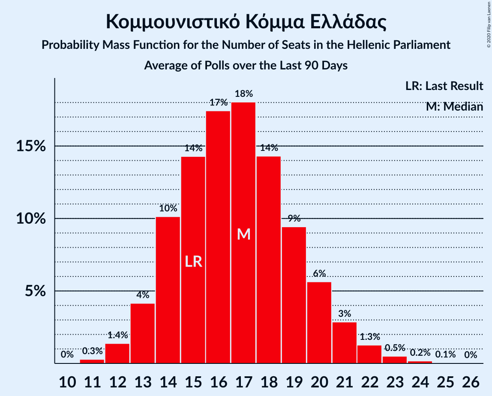

# Κομμουνιστικό Κόμμα Ελλάδας

<a href="#voting-intentions">Voting Intentions</a> | <a href="#seats">Seats</a>

## Voting Intentions

Last result: **5.6%** (General Election of 20 September 2015)

### Confidence Intervals

| Period     | Polling firm/Commissioner(s) | Median | 80% Confidence Interval | 90% Confidence Interval | 95% Confidence Interval | 99% Confidence Interval |
|:----------:|:----------------:|:-----------:|:-----------------------:|:-----------------------:|:-----------------------:|:-----------------------:|
| N/A | [Poll Average](average.html) | 6.5% | 5.0–7.7% | 4.6–8.1% | 4.4–8.4% | 3.9–9.0% |
| [6–8 May 2019](2019-05-08-VoxPopAnalysis.html) | Vox Pop Analysis   Documento | 5.0% | 4.3–5.9% | 4.1–6.1% | 3.9–6.3% | 3.6–6.8% |
| [6–8 May 2019](2019-05-08-MRB.html) | MRB   Star | 7.0% | 6.1–8.2% | 5.8–8.5% | 5.6–8.8% | 5.2–9.4% |
| [15–17 April 2019](2019-04-17-MetronAnalysis.html) | Metron Analysis   Alpha TV | 6.4% | 5.6–7.4% | 5.3–7.7% | 5.2–8.0% | 4.8–8.5% |
| [15–17 April 2019](2019-04-17-Interview.html) | Interview   Βεργίνα TV | 7.0% | 6.0–8.1% | 5.8–8.4% | 5.5–8.7% | 5.1–9.3% |
| [1–3 April 2019](2019-04-03-MRB.html) | MRB   Star | 7.2% | 6.2–8.3% | 6.0–8.7% | 5.7–8.9% | 5.3–9.5% |
| [26 March–1 April 2019](2019-04-01-Marc.html) | Marc   Πρώτο ΘΕΜΑ | 6.3% | 5.5–7.3% | 5.3–7.6% | 5.1–7.9% | 4.7–8.4% |
| [26–28 March 2019](2019-03-28-RASS.html) | RASS   in.gr | 8.5% | 7.4–9.7% | 7.1–10.0% | 6.9–10.3% | 6.4–11.0% |
| [23–27 March 2019](2019-03-27-PulseRC.html) | Pulse RC   ΣΚΑΪ | 7.0% | 6.2–8.0% | 6.0–8.2% | 5.8–8.5% | 5.5–8.9% |
| [19–26 March 2019](2019-03-26-Alco.html) | Alco | 7.0% | 6.1–8.2% | 5.8–8.5% | 5.6–8.8% | 5.2–9.3% |
| [18–20 March 2019](2019-03-20-VoxPopAnalysis.html) | Vox Pop Analysis   Documento | 4.4% | 3.7–5.3% | 3.5–5.6% | 3.3–5.9% | 3.0–6.4% |
| [18–20 March 2019](2019-03-20-MetronAnalysis.html) | Metron Analysis   Το Βήμα | 6.2% | 5.4–7.2% | 5.2–7.5% | 5.0–7.7% | 4.6–8.2% |
| [24–26 February 2019](2019-02-26-PulseRC.html) | Pulse RC   ΣΚΑΪ | 7.0% | 6.2–8.0% | 6.0–8.3% | 5.8–8.6% | 5.4–9.0% |
| [18–23 February 2019](2019-02-23-Alco.html) | Alco   Open | 7.0% | 6.1–8.2% | 5.8–8.5% | 5.6–8.8% | 5.2–9.3% |
| [1–14 February 2019](2019-02-14-PublicIssue.html) | Public Issue | 7.5% | 6.5–8.7% | 6.2–9.0% | 6.0–9.3% | 5.6–9.9% |
| [4–5 February 2019](2019-02-05-Interview.html) | Interview   Βεργίνα TV | 6.5% | 5.6–7.6% | 5.3–7.9% | 5.1–8.2% | 4.7–8.8% |
| [1–4 February 2019](2019-02-04-Prorata.html) | Prorata   Η Εφημερίδα των Συντακτών | 5.5% | 4.7–6.5% | 4.4–6.8% | 4.3–7.1% | 3.9–7.6% |
| [1–2 February 2019](2019-02-02-VoxPopAnalysis.html) | Vox Pop Analysis   Documento | 6.1% | 5.3–7.1% | 5.1–7.4% | 4.9–7.7% | 4.6–8.1% |
| [28–29 January 2019](2019-01-29-MetronAnalysis.html) | Metron Analysis   Το Βήμα | 3.5% | 3.2–3.8% | 3.2–3.9% | 3.1–3.9% | 3.0–4.1% |
| [21–24 January 2019](2019-01-24-RASS.html) | RASS   in.gr | 8.4% | 7.3–9.6% | 7.0–9.9% | 6.8–10.3% | 6.3–10.9% |
| [20–22 January 2019](2019-01-22-PulseRC.html) | Pulse RC   ΣΚΑΪ | 6.5% | 5.7–7.4% | 5.5–7.7% | 5.3–7.9% | 4.9–8.4% |
| [14–17 January 2019](2019-01-17-Marc.html) | Marc   Πρώτο ΘΕΜΑ | 6.9% | 6.0–8.0% | 5.7–8.4% | 5.5–8.6% | 5.1–9.2% |
| [10–16 January 2019](2019-01-16-OpinionPoll.html) | Opinion Poll | 5.5% | 4.7–6.5% | 4.4–6.8% | 4.3–7.1% | 3.9–7.6% |
| [16–18 December 2018](2018-12-18-PulseRC.html) | Pulse RC   ΣΚΑΪ | 7.0% | 6.2–8.0% | 6.0–8.3% | 5.8–8.5% | 5.4–9.0% |
| [5–10 December 2018](2018-12-10-Alco.html) | Alco   Open | 7.4% | 6.4–8.6% | 6.2–8.9% | 5.9–9.2% | 5.5–9.8% |
| [4–6 December 2018](2018-12-06-ΚάπαResearch.html) | Κάπα Research   thebest.gr | 7.4% | 6.4–8.5% | 6.1–8.9% | 5.9–9.2% | 5.5–9.8% |
| [28 November–6 December 2018](2018-12-06-MRB.html) | MRB   real.gr | 7.1% | 6.4–7.9% | 6.2–8.1% | 6.1–8.3% | 5.7–8.7% |
| [20–23 November 2018](2018-11-23-PalmosAnalysis.html) | Palmos Analysis   TVXS | 6.5% | 5.6–7.6% | 5.4–8.0% | 5.2–8.2% | 4.8–8.8% |
| [19–21 November 2018](2018-11-21-MetronAnalysis.html) | Metron Analysis   Τα Νέα | 6.3% | 5.5–7.3% | 5.3–7.6% | 5.1–7.8% | 4.7–8.3% |
| [18–20 November 2018](2018-11-20-PulseRC.html) | Pulse RC   ΣΚΑΪ | 7.5% | 6.7–8.5% | 6.4–8.8% | 6.2–9.1% | 5.9–9.6% |
| [6–16 November 2018](2018-11-16-PublicIssue.html) | Public Issue | 7.5% | 6.5–8.7% | 6.2–9.0% | 6.0–9.3% | 5.6–9.9% |
| [22–24 October 2018](2018-10-24-Marc.html) | Marc   Πρώτο ΘΕΜΑ | 7.3% | 6.3–8.4% | 6.1–8.8% | 5.8–9.1% | 5.4–9.7% |
| [14–16 October 2018](2018-10-16-PulseRC.html) | Pulse RC   ΣΚΑΪ | 7.5% | 6.7–8.5% | 6.4–8.8% | 6.2–9.1% | 5.9–9.6% |
| [18–21 September 2018](2018-09-21-PalmosAnalysis.html) | Palmos Analysis   TVXS | 6.0% | 5.1–7.1% | 4.9–7.4% | 4.7–7.7% | 4.3–8.2% |
| [18–20 September 2018](2018-09-20-MetronAnalysis.html) | Metron Analysis   Τα Νέα | 6.7% | 5.8–7.8% | 5.5–8.2% | 5.3–8.4% | 4.9–9.0% |
| [17–19 September 2018](2018-09-19-MRB.html) | MRB   Star | 7.2% | 6.2–8.3% | 6.0–8.7% | 5.7–8.9% | 5.3–9.5% |
| [17–19 September 2018](2018-09-19-Alco.html) | Alco   Kontra Channel | 7.5% | 6.5–8.7% | 6.2–9.0% | 6.0–9.3% | 5.6–9.9% |
| [17–18 September 2018](2018-09-18-ΚάπαResearch.html) | Κάπα Research   ΕΘΝΟΣ | 7.1% | 6.1–8.2% | 5.9–8.5% | 5.6–8.8% | 5.2–9.4% |
| [16–18 September 2018](2018-09-18-PulseRC.html) | Pulse RC   ΣΚΑΪ | 7.0% | 6.2–8.0% | 6.0–8.3% | 5.8–8.5% | 5.4–9.0% |
| [8 September 2018](2018-09-08-Marc.html) | Marc   Πρώτο ΘΕΜΑ | 7.3% | 6.3–8.5% | 6.1–8.8% | 5.8–9.1% | 5.4–9.7% |
| [25 June–2 July 2018](2018-07-02-ΚάπαResearch.html) | Κάπα Research   ΕΘΝΟΣ | 7.5% | N/A | N/A | N/A | N/A |
| [22–29 June 2018](2018-06-29-MRB.html) | MRB   Real | 6.9% | 6.2–7.7% | 6.0–7.9% | 5.9–8.1% | 5.5–8.5% |
| [26–28 June 2018](2018-06-28-MetronAnalysis.html) | Metron Analysis   Τα Νέα | 6.8% | 5.9–7.9% | 5.6–8.3% | 5.4–8.5% | 5.0–9.1% |
| [23–27 June 2018](2018-06-27-Alco.html) | Alco   Kontra Channel | 8.6% | 7.6–9.8% | 7.3–10.2% | 7.0–10.5% | 6.5–11.1% |
| [24–26 June 2018](2018-06-26-PulseRC.html) | Pulse RC   ΣΚΑΪ | 7.0% | 6.2–8.0% | 6.0–8.3% | 5.8–8.6% | 5.4–9.0% |
| [13–15 June 2018](2018-06-15-Marc.html) | Marc   Πρώτο ΘΕΜΑ | 7.9% | 6.9–9.1% | 6.6–9.4% | 6.4–9.7% | 5.9–10.3% |
| [29–31 May 2018](2018-05-31-RASS.html) | RASS   Action 24 | 8.3% | 7.3–9.5% | 7.0–9.9% | 6.7–10.2% | 6.3–10.8% |
| [16–20 May 2018](2018-05-20-Alco.html) | Alco   Kontra Channel | 6.0% | 5.0–7.2% | 4.8–7.5% | 4.5–7.8% | 4.1–8.5% |
| [13–15 May 2018](2018-05-15-PulseRC.html) | Pulse RC   ΣΚΑΪ | 7.0% | 6.2–8.0% | 6.0–8.3% | 5.8–8.5% | 5.4–9.0% |
| [23 April–7 May 2018](2018-05-07-PublicIssue.html) | Public Issue | 6.5% | 5.6–7.6% | 5.3–7.9% | 5.1–8.2% | 4.7–8.7% |
| [21 April 2018](2018-04-21-MetronAnalysis.html) | Metron Analysis   Τα Νέα | 6.7% | N/A | N/A | N/A | N/A |
| [15–17 April 2018](2018-04-17-PulseRC.html) | Pulse RC   ΣΚΑΪ | 7.5% | 6.7–8.5% | 6.4–8.8% | 6.2–9.1% | 5.9–9.6% |
| [11–16 April 2018](2018-04-16-Alco.html) | Alco   Ραδιόφωνο 24/7 | 6.3% | 5.4–7.4% | 5.2–7.7% | 5.0–8.0% | 4.6–8.6% |
| [12–15 April 2018](2018-04-15-PalmosAnalysis.html) | Palmos Analysis   TVXS | 8.5% | 7.5–9.8% | 7.2–10.1% | 7.0–10.4% | 6.5–11.0% |
| [3 April 2018](2018-04-03-ΚάπαResearch.html) | Κάπα Research   ΕΘΝΟΣ | 8.3% | 7.9–8.7% | 7.8–8.8% | 7.7–8.9% | 7.5–9.1% |
| [1–23 March 2018](2018-03-23-Marc.html) | Marc   Πρώτο ΘΕΜΑ | 7.8% | N/A | N/A | N/A | N/A |
| [11–13 March 2018](2018-03-13-PulseRC.html) | Pulse RC   ΣΚΑΪ | 7.0% | 6.1–8.0% | 5.9–8.2% | 5.7–8.5% | 5.3–9.0% |
| [6–8 March 2018](2018-03-08-RASS.html) | RASS   Πρώτο Θέμα | 7.7% | 6.7–8.9% | 6.4–9.2% | 6.2–9.5% | 5.7–10.1% |
| [3 March 2018](2018-03-03-PulseRC.html) | Pulse RC   Δημοκρατία | 7.0% | N/A | N/A | N/A | N/A |
| [3 March 2018](2018-03-03-OpinionPoll.html) | Opinion Poll   Παρασκήνιο | 7.1% | N/A | N/A | N/A | N/A |
| [22–24 February 2018](2018-02-24-Alco.html) | Alco   ΕΘΝΟΣ | 7.5% | 6.5–8.7% | 6.2–9.0% | 6.0–9.3% | 5.6–9.9% |
| [12–23 February 2018](2018-02-23-MetronAnalysis.html) | Metron Analysis   Το Βήμα | 7.0% | 6.4–7.7% | 6.2–7.9% | 6.0–8.1% | 5.7–8.5% |
| [25–29 January 2018](2018-01-29-PulseRC.html) | Pulse RC   Action 24 | 6.5% | 5.8–7.4% | 5.6–7.7% | 5.4–7.9% | 5.0–8.3% |
| [20 January 2018](2018-01-20-MetronAnalysis.html) | Metron Analysis   Τα Νέα | 6.9% | N/A | N/A | N/A | N/A |
| [8–18 January 2018](2018-01-18-PublicIssue.html) | Public Issue | 7.5% | 6.6–8.7% | 6.3–9.0% | 6.1–9.3% | 5.6–9.9% |
| [16–18 January 2018](2018-01-18-Alco.html) | Alco   Ραδιόφωνο 24/7 | 7.3% | 6.3–8.5% | 6.1–8.8% | 5.8–9.1% | 5.4–9.7% |
| [13 January 2018](2018-01-13-Marc.html) | Marc   Πρώτο ΘΕΜΑ | 7.7% | N/A | N/A | N/A | N/A |
| [8–10 January 2018](2018-01-10-PulseRC.html) | Pulse RC   bankingnews.gr | 6.5% | 5.6–7.5% | 5.4–7.7% | 5.2–8.0% | 4.8–8.5% |

### Probability Mass Function

The following table shows the probability mass function per percentage block of voting intentions for the [poll average](average.html) for Κομμουνιστικό Κόμμα Ελλάδας.

| Voting Intentions | Probability | Accumulated | Special Marks |
|:-----------------:|:-----------:|:-----------:|:-------------:|
| 2.5–3.5% | 0.1% | 100% |  |
| 3.5–4.5% | 4% | 99.9% |  |
| 4.5–5.5% | 16% | 96% |  |
| 5.5–6.5% | 32% | 79% | Last Result, Median |
| 6.5–7.5% | 33% | 47% |  |
| 7.5–8.5% | 12% | 14% |  |
| 8.5–9.5% | 2% | 2% |  |
| 9.5–10.5% | 0.1% | 0.1% |  |
| 10.5–11.5% | 0% | 0% |  |

## Seats

Last result: **15** seats (General Election of 20 September 2015)

### Confidence Intervals

| Period     | Polling firm/Commissioner(s) | Median | 80% Confidence Interval | 90% Confidence Interval | 95% Confidence Interval | 99% Confidence Interval |
|:----------:|:----------------:|:------:|:-----------------------:|:-----------------------:|:-----------------------:|:-----------------------:|
| N/A | [Poll Average](average.html) | 18 | 15–22 | 15–23 | 15–24 | 12–26 |
| [6–8 May 2019](2019-05-08-VoxPopAnalysis.html) | Vox Pop Analysis   Documento | 15 | 15 | 13–16 | 12–16 | 12–18 |
| [6–8 May 2019](2019-05-08-MRB.html) | MRB   Star | 20 | 17–23 | 17–24 | 16–25 | 15–27 |
| [15–17 April 2019](2019-04-17-MetronAnalysis.html) | Metron Analysis   Alpha TV | 19 | 17–21 | 16–21 | 15–22 | 14–23 |
| [15–17 April 2019](2019-04-17-Interview.html) | Interview   Βεργίνα TV | 19 | 17–22 | 17–23 | 16–25 | 15–27 |
| [1–3 April 2019](2019-04-03-MRB.html) | MRB   Star | 21 | 17–24 | 16–25 | 16–25 | 15–27 |
| [26 March–1 April 2019](2019-04-01-Marc.html) | Marc   Πρώτο ΘΕΜΑ | 18 | 16–20 | 15–22 | 15–22 | 13–24 |
| [26–28 March 2019](2019-03-28-RASS.html) | RASS   in.gr | 23 | 20–27 | 20–28 | 19–28 | 17–30 |
| [23–27 March 2019](2019-03-27-PulseRC.html) | Pulse RC   ΣΚΑΪ | 20 | 18–22 | 18–23 | 17–25 | 15–25 |
| [19–26 March 2019](2019-03-26-Alco.html) | Alco | 21 | 18–25 | 17–25 | 17–26 | 15–28 |
| [18–20 March 2019](2019-03-20-VoxPopAnalysis.html) | Vox Pop Analysis   Documento | 15 | 12–18 | 11–18 | 10–19 | 0–21 |
| [18–20 March 2019](2019-03-20-MetronAnalysis.html) | Metron Analysis   Το Βήμα | 19 | 16–21 | 15–23 | 15–23 | 14–24 |
| [24–26 February 2019](2019-02-26-PulseRC.html) | Pulse RC   ΣΚΑΪ | 20 | 13–24 | 13–24 | 13–24 | 13–24 |
| [18–23 February 2019](2019-02-23-Alco.html) | Alco   Open | 19 | 19–22 | 19–27 | 19–27 | 18–27 |
| [1–14 February 2019](2019-02-14-PublicIssue.html) | Public Issue | 21 | 18–24 | 17–25 | 17–26 | 15–28 |
| [4–5 February 2019](2019-02-05-Interview.html) | Interview   Βεργίνα TV | 20 | 16–23 | 16–23 | 15–24 | 14–25 |
| [1–4 February 2019](2019-02-04-Prorata.html) | Prorata   Η Εφημερίδα των Συντακτών | 20 | 17–22 | 16–22 | 16–23 | 15–23 |
| [1–2 February 2019](2019-02-02-VoxPopAnalysis.html) | Vox Pop Analysis   Documento | 17 | 15–20 | 15–21 | 14–22 | 13–25 |
| [28–29 January 2019](2019-01-29-MetronAnalysis.html) | Metron Analysis   Το Βήμα | 12 | 10–13 | 10–13 | 10–13 | 0–14 |
| [21–24 January 2019](2019-01-24-RASS.html) | RASS   in.gr | 23 | 20–26 | 19–27 | 19–28 | 17–30 |
| [20–22 January 2019](2019-01-22-PulseRC.html) | Pulse RC   ΣΚΑΪ | 19 | 17–21 | 16–22 | 15–22 | 13–24 |
| [14–17 January 2019](2019-01-17-Marc.html) | Marc   Πρώτο ΘΕΜΑ | 20 | 17–22 | 16–24 | 15–25 | 14–27 |
| [10–16 January 2019](2019-01-16-OpinionPoll.html) | Opinion Poll | 17 | 15–19 | 14–19 | 13–21 | 12–22 |
| [16–18 December 2018](2018-12-18-PulseRC.html) | Pulse RC   ΣΚΑΪ | 21 | 18–23 | 17–23 | 16–24 | 15–26 |
| [5–10 December 2018](2018-12-10-Alco.html) | Alco   Open | 22 | 19–26 | 18–26 | 17–27 | 16–29 |
| [4–6 December 2018](2018-12-06-ΚάπαResearch.html) | Κάπα Research   thebest.gr | 22 | 19–25 | 17–26 | 17–27 | 16–29 |
| [28 November–6 December 2018](2018-12-06-MRB.html) | MRB   real.gr | 20 | 18–22 | 18–23 | 17–23 | 16–25 |
| [20–23 November 2018](2018-11-23-PalmosAnalysis.html) | Palmos Analysis   TVXS | 19 | 16–22 | 15–23 | 15–23 | 14–25 |
| [19–21 November 2018](2018-11-21-MetronAnalysis.html) | Metron Analysis   Τα Νέα | 19 | 16–21 | 16–22 | 15–23 | 14–24 |
| [18–20 November 2018](2018-11-20-PulseRC.html) | Pulse RC   ΣΚΑΪ | 21 | 19–23 | 19–25 | 17–25 | 17–27 |
| [6–16 November 2018](2018-11-16-PublicIssue.html) | Public Issue | 22 | 19–25 | 18–26 | 18–27 | 16–29 |
| [22–24 October 2018](2018-10-24-Marc.html) | Marc   Πρώτο ΘΕΜΑ | 21 | 18–25 | 17–26 | 17–27 | 16–29 |
| [14–16 October 2018](2018-10-16-PulseRC.html) | Pulse RC   ΣΚΑΪ | 21 | 19–24 | 17–25 | 17–25 | 16–27 |
| [18–21 September 2018](2018-09-21-PalmosAnalysis.html) | Palmos Analysis   TVXS | 19 | 16–21 | 15–22 | 14–22 | 13–25 |
| [18–20 September 2018](2018-09-20-MetronAnalysis.html) | Metron Analysis   Τα Νέα | 21 | 18–22 | 17–23 | 16–24 | 15–25 |
| [17–19 September 2018](2018-09-19-MRB.html) | MRB   Star | 21 | 19–22 | 18–23 | 17–24 | 16–26 |
| [17–19 September 2018](2018-09-19-Alco.html) | Alco   Kontra Channel | 23 | 20–26 | 19–26 | 18–27 | 16–29 |
| [17–18 September 2018](2018-09-18-ΚάπαResearch.html) | Κάπα Research   ΕΘΝΟΣ | 21 | 18–24 | 18–26 | 16–26 | 15–26 |
| [16–18 September 2018](2018-09-18-PulseRC.html) | Pulse RC   ΣΚΑΪ | 19 | 18–23 | 17–23 | 16–24 | 15–25 |
| [8 September 2018](2018-09-08-Marc.html) | Marc   Πρώτο ΘΕΜΑ | 21 | 17–25 | 17–26 | 16–27 | 15–30 |
| [25 June–2 July 2018](2018-07-02-ΚάπαResearch.html) | Κάπα Research   ΕΘΝΟΣ |  |  |  |  |  |
| [22–29 June 2018](2018-06-29-MRB.html) | MRB   Real | 19 | 17–21 | 17–22 | 16–22 | 16–23 |
| [26–28 June 2018](2018-06-28-MetronAnalysis.html) | Metron Analysis   Τα Νέα | 20 | 17–23 | 16–24 | 16–24 | 14–26 |
| [23–27 June 2018](2018-06-27-Alco.html) | Alco   Kontra Channel | 26 | 22–29 | 21–30 | 20–31 | 19–34 |
| [24–26 June 2018](2018-06-26-PulseRC.html) | Pulse RC   ΣΚΑΪ | 20 | 18–20 | 17–22 | 16–23 | 15–25 |
| [13–15 June 2018](2018-06-15-Marc.html) | Marc   Πρώτο ΘΕΜΑ | 23 | 20–26 | 19–27 | 18–28 | 17–29 |
| [29–31 May 2018](2018-05-31-RASS.html) | RASS   Action 24 | 23 | 20–25 | 19–26 | 18–27 | 17–29 |
| [16–20 May 2018](2018-05-20-Alco.html) | Alco   Kontra Channel | 23 | 20–26 | 19–26 | 18–27 | 16–31 |
| [13–15 May 2018](2018-05-15-PulseRC.html) | Pulse RC   ΣΚΑΪ | 20 | 17–23 | 16–24 | 15–25 | 15–26 |
| [23 April–7 May 2018](2018-05-07-PublicIssue.html) | Public Issue | 19 | 16–22 | 15–22 | 15–22 | 13–25 |
| [21 April 2018](2018-04-21-MetronAnalysis.html) | Metron Analysis   Τα Νέα |  |  |  |  |  |
| [15–17 April 2018](2018-04-17-PulseRC.html) | Pulse RC   ΣΚΑΪ | 21 | 19–24 | 18–25 | 17–25 | 16–27 |
| [11–16 April 2018](2018-04-16-Alco.html) | Alco   Ραδιόφωνο 24/7 | 20 | 16–22 | 14–24 | 14–24 | 14–25 |
| [12–15 April 2018](2018-04-15-PalmosAnalysis.html) | Palmos Analysis   TVXS | 25 | 22–28 | 21–30 | 20–30 | 19–32 |
| [3 April 2018](2018-04-03-ΚάπαResearch.html) | Κάπα Research   ΕΘΝΟΣ | 25 | 24–25 | 24–25 | 23–26 | 23–27 |
| [1–23 March 2018](2018-03-23-Marc.html) | Marc   Πρώτο ΘΕΜΑ |  |  |  |  |  |
| [11–13 March 2018](2018-03-13-PulseRC.html) | Pulse RC   ΣΚΑΪ | 20 | 17–22 | 16–23 | 16–25 | 15–26 |
| [6–8 March 2018](2018-03-08-RASS.html) | RASS   Πρώτο Θέμα | 21 | 18–24 | 17–25 | 17–25 | 15–27 |
| [3 March 2018](2018-03-03-PulseRC.html) | Pulse RC   Δημοκρατία |  |  |  |  |  |
| [3 March 2018](2018-03-03-OpinionPoll.html) | Opinion Poll   Παρασκήνιο |  |  |  |  |  |
| [22–24 February 2018](2018-02-24-Alco.html) | Alco   ΕΘΝΟΣ | 21 | 18–21 | 18–22 | 18–24 | 17–29 |
| [12–23 February 2018](2018-02-23-MetronAnalysis.html) | Metron Analysis   Το Βήμα | 20 | 19–22 | 17–23 | 17–24 | 16–25 |
| [25–29 January 2018](2018-01-29-PulseRC.html) | Pulse RC   Action 24 | 19 | 16–21 | 16–21 | 15–22 | 14–23 |
| [20 January 2018](2018-01-20-MetronAnalysis.html) | Metron Analysis   Τα Νέα |  |  |  |  |  |
| [8–18 January 2018](2018-01-18-PublicIssue.html) | Public Issue | 21 | 19–24 | 18–25 | 18–26 | 17–28 |
| [16–18 January 2018](2018-01-18-Alco.html) | Alco   Ραδιόφωνο 24/7 | 21 | 18–23 | 17–25 | 16–26 | 15–27 |
| [13 January 2018](2018-01-13-Marc.html) | Marc   Πρώτο ΘΕΜΑ |  |  |  |  |  |
| [8–10 January 2018](2018-01-10-PulseRC.html) | Pulse RC   bankingnews.gr | 18 | 16–21 | 15–22 | 15–23 | 14–24 |

### Probability Mass Function

The following table shows the probability mass function per seat for the [poll average](average.html) for Κομμουνιστικό Κόμμα Ελλάδας.

| Number of Seats | Probability | Accumulated | Special Marks |
|:---------------:|:-----------:|:-----------:|:-------------:|
| 12 | 0.9% | 100% |  |
| 13 | 0.6% | 99.1% |  |
| 14 | 0.5% | 98.5% |  |
| 15 | 20% | 98% | Last Result |
| 16 | 4% | 78% |  |
| 17 | 7% | 74% |  |
| 18 | 22% | 66% | Median |
| 19 | 15% | 44% |  |
| 20 | 11% | 29% |  |
| 21 | 7% | 17% |  |
| 22 | 5% | 11% |  |
| 23 | 3% | 6% |  |
| 24 | 1.4% | 3% |  |
| 25 | 0.7% | 1.5% |  |
| 26 | 0.4% | 0.8% |  |
| 27 | 0.3% | 0.3% |  |
| 28 | 0.1% | 0.1% |  |
| 29 | 0% | 0% |  |

