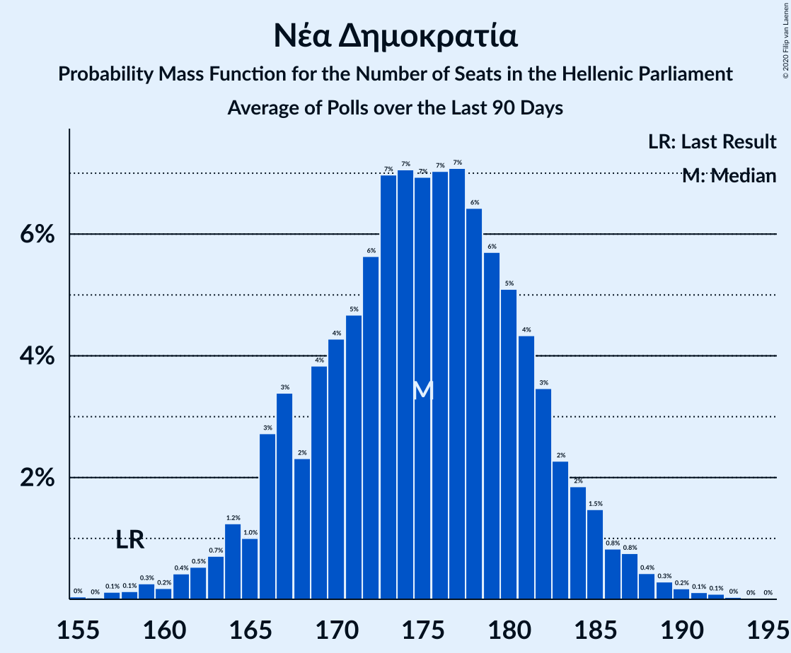

# Νέα Δημοκρατία

<a href="#voting-intentions">Voting Intentions</a> | <a href="#seats">Seats</a>

## Voting Intentions

Last result: **39.8%** (General Election of 7 July 2019)

### Confidence Intervals

| Period     | Polling firm/Commissioner(s) | Median | 80% Confidence Interval | 90% Confidence Interval | 95% Confidence Interval | 99% Confidence Interval |
|:----------:|:----------------:|:-----------:|:-----------------------:|:-----------------------:|:-----------------------:|:-----------------------:|
| N/A | [Poll Average](average.html) | 43.7% | 41.0–48.3% | 40.3–49.4% | 39.8–50.2% | 38.8–51.6% |
| [9–12 July 2021](2021-07-12-Interview.html) | Interview   Βεργίνα TV | 43.1% | 41.1–45.1% | 40.5–45.7% | 40.1–46.2% | 39.1–47.2% |
| [7–11 July 2021](2021-07-11-GPO.html) | GPO   ANT1 | 42.8% | 40.8–44.8% | 40.2–45.4% | 39.8–45.9% | 38.8–46.9% |
| [27 June–7 July 2021](2021-07-07-PulseRC.html) | Pulse RC   ΣΚΑΪ | 41.4% | 39.6–43.1% | 39.2–43.7% | 38.7–44.1% | 37.9–44.9% |
| [1–7 July 2021](2021-07-07-OpinionPoll.html) | Opinion Poll   tomanifesto.gr | 46.4% | 44.6–48.2% | 44.1–48.7% | 43.7–49.1% | 42.8–50.0% |
| [4–7 July 2021](2021-07-07-MRB.html) | MRB   Star | 43.6% | 41.6–45.6% | 41.0–46.2% | 40.5–46.7% | 39.6–47.7% |
| [1–2 July 2021](2021-07-02-GPO.html) | GPO   Τα Νέα | 42.9% | 40.9–44.9% | 40.3–45.5% | 39.9–46.0% | 38.9–47.0% |
| [20–25 June 2021](2021-06-25-Marc.html) | Marc   Πρώτο ΘΕΜΑ | 48.7% | 46.7–50.7% | 46.1–51.3% | 45.6–51.8% | 44.6–52.8% |
| [17–23 June 2021](2021-06-23-Interview.html) | Interview   Βεργίνα TV | 42.0% | 40.1–43.9% | 39.6–44.5% | 39.1–44.9% | 38.2–45.9% |
| [15–19 June 2021](2021-06-19-Alco.html) | Alco   Open TV | 43.2% | 41.2–45.2% | 40.6–45.8% | 40.2–46.3% | 39.2–47.3% |
| [4–7 June 2021](2021-06-07-GPO.html) | GPO   ANT1 | 42.6% | 40.6–44.6% | 40.0–45.2% | 39.6–45.7% | 38.6–46.7% |
| [31 May–2 June 2021](2021-06-02-PulseRC.html) | Pulse RC   ΣΚΑΪ | 42.3% | 40.6–44.1% | 40.1–44.6% | 39.7–45.0% | 38.8–45.9% |
| [27–30 May 2021](2021-05-30-OpinionPoll.html) | Opinion Poll | 46.6% | 45.0–48.2% | 44.6–48.7% | 44.2–49.1% | 43.4–49.9% |
| [18–24 May 2021](2021-05-24-MetronAnalysis.html) | Metron Analysis   Mega | 43.1% | 41.1–45.1% | 40.5–45.7% | 40.1–46.2% | 39.1–47.2% |
| [17–21 May 2021](2021-05-21-Alco.html) | Alco   Open TV | 45.8% | 43.7–47.8% | 43.2–48.4% | 42.7–48.9% | 41.7–49.8% |
| [15–17 May 2021](2021-05-17-Interview.html) | Interview   Βεργίνα TV | 42.0% | 40.0–44.0% | 39.5–44.6% | 39.0–45.1% | 38.0–46.1% |
| [5–7 May 2021](2021-05-07-GPO.html) | GPO   ANT1 | 43.4% | 41.4–45.4% | 40.8–46.0% | 40.3–46.5% | 39.4–47.5% |
| [27–29 April 2021](2021-04-29-Marc.html) | Marc   Πρώτο ΘΕΜΑ | 44.7% | 42.7–46.7% | 42.1–47.3% | 41.6–47.8% | 40.7–48.8% |
| [20–25 April 2021](2021-04-25-PulseRC.html) | Pulse RC   ΣΚΑΪ | 42.0% | 40.0–44.0% | 39.5–44.6% | 39.0–45.1% | 38.0–46.1% |
| [21–24 April 2021](2021-04-24-OpinionPoll.html) | Opinion Poll | 46.7% | 44.7–48.7% | 44.1–49.3% | 43.6–49.8% | 42.7–50.8% |
| [19–22 April 2021](2021-04-22-Interview.html) | Interview   Politic.gr | 42.3% | 40.5–44.2% | 39.9–44.8% | 39.5–45.3% | 38.6–46.2% |
| [13–19 April 2021](2021-04-19-Interview.html) | Interview   Βεργίνα TV | 42.3% | 40.5–44.2% | 39.9–44.8% | 39.5–45.3% | 38.6–46.2% |
| [12–16 April 2021](2021-04-16-Alco.html) | Alco   Open TV | 43.3% | 41.3–45.3% | 40.7–45.9% | 40.3–46.4% | 39.3–47.4% |
| [10–12 April 2021](2021-04-12-GPO.html) | GPO   powergame.gr | 42.5% | 40.5–44.5% | 39.9–45.1% | 39.5–45.6% | 38.5–46.6% |
| [8–9 April 2021](2021-04-09-Prorata.html) | Prorata   Η Εφημερίδα των Συντακτών | 41.5% | 39.5–43.5% | 39.0–44.1% | 38.5–44.6% | 37.5–45.6% |
| [26–28 March 2021](2021-03-28-PulseRC.html) | Pulse RC   ΣΚΑΪ | 41.3% | 39.5–43.0% | 39.0–43.5% | 38.6–44.0% | 37.8–44.8% |
| [17–23 March 2021](2021-03-23-MetronAnalysis.html) | Metron Analysis   Mega | 43.4% | 41.4–45.4% | 40.8–46.0% | 40.3–46.5% | 39.4–47.5% |
| [19–22 March 2021](2021-03-22-Marc.html) | Marc   Alpha TV | 45.2% | 43.2–47.2% | 42.6–47.8% | 42.1–48.3% | 41.2–49.2% |
| [17–22 March 2021](2021-03-22-Interview.html) | Interview   Βεργίνα TV | 42.7% | 40.7–44.7% | 40.1–45.3% | 39.7–45.8% | 38.7–46.8% |
| [14–18 March 2021](2021-03-18-Alco.html) | Alco   Open TV | 42.8% | 40.8–44.8% | 40.2–45.4% | 39.8–45.9% | 38.8–46.9% |
| [3–5 March 2021](2021-03-05-GPO.html) | GPO   Τα Νέα | 43.5% | 41.5–45.5% | 40.9–46.1% | 40.5–46.6% | 39.5–47.6% |
| [1–3 March 2021](2021-03-03-MRB.html) | MRB   Star | 45.0% | 43.0–47.0% | 42.4–47.6% | 41.9–48.1% | 41.0–49.1% |
| [26–28 February 2021](2021-02-28-PulseRC.html) | Pulse RC   ΣΚΑΪ | 42.0% | 40.3–43.8% | 39.8–44.3% | 39.4–44.7% | 38.5–45.6% |
| [22–27 February 2021](2021-02-27-MetronAnalysis.html) | Metron Analysis   Mega | 44.0% | 42.2–45.8% | 41.6–46.3% | 41.2–46.8% | 40.3–47.7% |
| [23–26 February 2021](2021-02-26-Prorata.html) | Prorata   Η Εφημερίδα των Συντακτών | 42.0% | 40.0–44.0% | 39.5–44.6% | 39.0–45.1% | 38.0–46.1% |
| [22–26 February 2021](2021-02-26-OpinionPoll.html) | Opinion Poll   Political | 46.4% | 44.3–48.4% | 43.8–49.0% | 43.3–49.5% | 42.3–50.4% |
| [20–24 February 2021](2021-02-24-ΚάπαResearch.html) | Κάπα Research | 44.3% | 42.9–45.7% | 42.5–46.1% | 42.1–46.5% | 41.5–47.2% |
| [15–19 February 2021](2021-02-19-OpinionPoll.html) | Opinion Poll   Political | 46.3% | 44.2–48.3% | 43.7–48.9% | 43.2–49.4% | 42.2–50.3% |
| [15–18 February 2021](2021-02-18-Alco.html) | Alco   Open TV | 43.2% | 41.2–45.2% | 40.6–45.8% | 40.2–46.3% | 39.2–47.3% |
| [15–17 February 2021](2021-02-17-Interview.html) | Interview   Βεργίνα TV | 43.2% | 41.2–45.2% | 40.6–45.8% | 40.2–46.3% | 39.2–47.3% |
| [25–27 January 2021](2021-01-27-PulseRC.html) | Pulse RC   ΣΚΑΪ | 43.0% | 41.5–44.6% | 41.1–45.0% | 40.7–45.4% | 40.0–46.1% |
| [19–25 January 2021](2021-01-25-MetronAnalysis.html) | Metron Analysis   Mega | 46.3% | 44.5–48.2% | 44.0–48.7% | 43.5–49.2% | 42.6–50.1% |
| [19–22 January 2021](2021-01-22-GPO.html) | GPO   Παραπολιτικά | 44.1% | 42.1–46.1% | 41.5–46.7% | 41.0–47.2% | 40.1–48.2% |
| [14–19 January 2021](2021-01-19-Alco.html) | Alco   Open TV | 44.2% | 42.2–46.2% | 41.6–46.8% | 41.1–47.3% | 40.2–48.3% |
| [7–16 January 2021](2021-01-16-ToThePoint.html) | To The Point   Voria.gr | 42.5% | 40.4–44.7% | 39.8–45.3% | 39.3–45.8% | 38.3–46.8% |
| [7–11 January 2021](2021-01-11-Marc.html) | Marc   Αlpha TV | 48.3% | 46.3–50.3% | 45.7–50.9% | 45.2–51.4% | 44.3–52.4% |
| [4–8 January 2021](2021-01-08-OpinionPoll.html) | Opinion Poll | 47.8% | 45.8–49.8% | 45.2–50.4% | 44.7–50.9% | 43.8–51.9% |
| [12–16 December 2020](2020-12-16-PulseRC.html) | Pulse RC   ΣΚΑΪ | 43.7% | 41.9–45.5% | 41.4–46.0% | 41.0–46.4% | 40.2–47.2% |
| [27–11 December 2020](2020-12-11-MRB.html) | MRB   Star | 44.9% | 43.0–46.8% | 42.5–47.3% | 42.1–47.8% | 41.2–48.6% |
| [3–9 December 2020](2020-12-09-Alco.html) | Alco   Open TV | 44.1% | 42.1–46.1% | 41.5–46.7% | 41.0–47.2% | 40.1–48.2% |
| [3–7 December 2020](2020-12-07-Interview.html) | Interview   Βεργίνα TV | 44.8% | 43.0–46.7% | 42.5–47.2% | 42.0–47.6% | 41.2–48.5% |
| [26 November–2 December 2020](2020-12-02-Interview.html) | Interview   Βεργίνα TV | 45.2% | 43.3–47.1% | 42.7–47.7% | 42.2–48.1% | 41.4–49.1% |
| [24–27 November 2020](2020-11-27-Prorata.html) | Prorata | 44.2% | 43.0–45.4% | 42.6–45.8% | 42.3–46.1% | 41.8–46.7% |
| [24–26 November 2020](2020-11-26-PulseRC.html) | Pulse RC   ΣΚΑΪ | 44.0% | 42.2–45.8% | 41.7–46.3% | 41.3–46.7% | 40.5–47.5% |
| [18–24 November 2020](2020-11-24-MetronAnalysis.html) | Metron Analysis   MEGA TV | 45.8% | 44.0–47.7% | 43.5–48.2% | 43.0–48.6% | 42.1–49.5% |
| [22–24 November 2020](2020-11-24-MRB.html) | MRB   Star | 47.0% | 45.0–49.0% | 44.4–49.6% | 43.9–50.1% | 43.0–51.1% |
| [17–19 November 2020](2020-11-19-ΚάπαResearch.html) | Κάπα Research | 45.7% | 43.8–47.7% | 43.2–48.3% | 42.7–48.8% | 41.8–49.7% |
| [10–13 November 2020](2020-11-13-GPO.html) | GPO   Παραπολιτικά | 44.5% | 42.5–46.5% | 41.9–47.1% | 41.4–47.6% | 40.5–48.6% |
| [4–11 November 2020](2020-11-11-OpinionPoll.html) | Opinion Poll | 48.6% | 46.6–50.6% | 46.0–51.2% | 45.5–51.7% | 44.5–52.7% |
| [6–11 November 2020](2020-11-11-Alco.html) | Alco   Open TV | 43.4% | 41.4–45.4% | 40.8–46.0% | 40.3–46.5% | 39.4–47.5% |
| [26–28 October 2020](2020-10-28-GPO.html) | GPO   Action24 | 45.6% | 43.6–47.6% | 43.0–48.2% | 42.5–48.7% | 41.6–49.7% |
| [18–22 October 2020](2020-10-22-PulseRC.html) | Pulse RC   ΣΚΑΪ | 45.1% | 43.1–47.1% | 42.5–47.7% | 42.0–48.2% | 41.1–49.2% |
| [16–21 October 2020](2020-10-21-Interview.html) | Interview   Βεργίνα TV | 45.5% | 43.7–47.4% | 43.1–47.9% | 42.7–48.4% | 41.8–49.3% |
| [11–15 October 2020](2020-10-15-OpinionPoll.html) | Opinion Poll | 49.9% | 47.9–51.9% | 47.3–52.5% | 46.8–53.0% | 45.8–54.0% |
| [10–14 October 2020](2020-10-14-Marc.html) | Marc   Αlpha TV | 48.9% | 46.8–50.9% | 46.3–51.5% | 45.8–52.0% | 44.8–52.9% |
| [6–10 October 2020](2020-10-10-Alco.html) | Alco   Open TV | 43.1% | 41.1–45.1% | 40.5–45.7% | 40.1–46.2% | 39.1–47.2% |
| [23–29 September 2020](2020-09-29-MetronAnalysis.html) | Metron Analysis   MEGA TV | 47.9% | 46.1–49.8% | 45.6–50.3% | 45.1–50.8% | 44.2–51.6% |
| [22–23 September 2020](2020-09-23-PulseRC.html) | Pulse RC   ΣΚΑΪ | 45.4% | 43.6–47.1% | 43.1–47.6% | 42.7–48.1% | 41.8–48.9% |
| [21–23 September 2020](2020-09-23-MRB.html) | MRB   Star | 48.0% | 46.0–50.0% | 45.4–50.6% | 44.9–51.1% | 43.9–52.0% |
| [21–23 September 2020](2020-09-23-Interview.html) | Interview   Βεργίνα TV | 45.4% | 43.5–47.3% | 43.0–47.9% | 42.5–48.4% | 41.6–49.3% |
| [14–16 September 2020](2020-09-16-GPO.html) | GPO   Παραπολιτικά | 46.6% | 44.6–48.6% | 44.0–49.2% | 43.5–49.7% | 42.6–50.7% |
| [14–16 September 2020](2020-09-16-Alco.html) | Alco   Open TV | 44.4% | 42.4–46.4% | 41.8–47.0% | 41.3–47.5% | 40.4–48.5% |
| [10–12 September 2020](2020-09-12-Marc.html) | Marc   Πρώτο ΘΕΜΑ | 49.9% | 48.3–51.5% | 47.8–52.0% | 47.4–52.4% | 46.6–53.2% |
| [7–10 September 2020](2020-09-10-OpinionPoll.html) | Opinion Poll | 51.1% | 49.1–53.1% | 48.5–53.7% | 48.0–54.2% | 47.0–55.2% |
| [30 August–2 September 2020](2020-09-02-GPO.html) | GPO   Τα Νέα | 46.9% | 44.9–48.9% | 44.3–49.5% | 43.8–50.0% | 42.9–51.0% |
| [13–15 July 2020](2020-07-15-Interview.html) | Interview   Βεργίνα TV | 47.4% | 45.5–49.3% | 44.9–49.9% | 44.5–50.3% | 43.5–51.3% |
| [10–13 July 2020](2020-07-13-Marc.html) | Marc   Αlpha TV | 50.1% | 48.1–52.1% | 47.5–52.7% | 47.0–53.2% | 46.1–54.1% |
| [6–8 July 2020](2020-07-08-PulseRC.html) | Pulse RC   ΣΚΑΪ | 46.5% | 44.7–48.3% | 44.2–48.8% | 43.8–49.2% | 43.0–50.1% |
| [29 June–4 July 2020](2020-07-04-Alco.html) | Alco   Open TV | 46.1% | 44.1–48.1% | 43.5–48.7% | 43.0–49.2% | 42.1–50.2% |
| [1–3 July 2020](2020-07-03-OpinionPoll.html) | Opinion Poll | 49.1% | 47.2–51.0% | 46.6–51.6% | 46.1–52.0% | 45.2–53.0% |
| [2 July 2020](2020-07-02-ΚάπαResearch.html) | Κάπα Research | 47.3% | 45.3–49.3% | 44.7–49.9% | 44.2–50.4% | 43.3–51.4% |
| [1–2 July 2020](2020-07-02-Marc.html) | Marc | 52.2% | 50.8–53.6% | 50.4–54.0% | 50.0–54.4% | 49.3–55.1% |
| [24–29 June 2020](2020-06-29-MetronAnalysis.html) | Metron Analysis   Το Βήμα | 50.4% | 48.7–52.2% | 48.2–52.6% | 47.8–53.1% | 47.0–53.9% |
| [22–26 June 2020](2020-06-26-Prorata.html) | Prorata | 46.0% | 44.6–47.4% | 44.2–47.8% | 43.9–48.1% | 43.3–48.8% |
| [22–26 June 2020](2020-06-26-GPO.html) | GPO   Τα Νέα | 49.0% | 47.3–50.7% | 46.9–51.1% | 46.5–51.5% | 45.7–52.3% |
| [17–25 June 2020](2020-06-25-MRB.html) | MRB   Star | 46.2% | 44.8–47.6% | 44.4–47.9% | 44.1–48.3% | 43.5–48.9% |
| [4–9 June 2020](2020-06-09-Interview.html) | Interview   Βεργίνα TV | 47.1% | 45.2–49.0% | 44.6–49.6% | 44.2–50.1% | 43.2–51.0% |
| [2–8 June 2020](2020-06-08-Alco.html) | Alco   Open TV | 46.1% | 44.1–48.1% | 43.5–48.7% | 43.0–49.2% | 42.1–50.2% |
| [1–3 June 2020](2020-06-03-PulseRC.html) | Pulse RC   ΣΚΑΪ | 48.0% | 46.2–49.9% | 45.6–50.4% | 45.2–50.8% | 44.3–51.7% |
| [1–3 June 2020](2020-06-03-OpinionPoll.html) | Opinion Poll   paraskhnio.gr | 50.9% | 49.0–52.9% | 48.4–53.5% | 47.9–54.0% | 47.0–54.9% |
| [22–27 May 2020](2020-05-27-MetronAnalysis.html) | Metron Analysis   MEGA TV | 49.6% | 47.8–51.5% | 47.2–52.0% | 46.8–52.5% | 45.9–53.3% |
| [22–27 May 2020](2020-05-27-GPO.html) | GPO   Παραπολιτικά | 50.2% | 48.2–52.2% | 47.6–52.8% | 47.1–53.3% | 46.1–54.3% |
| [8–13 May 2020](2020-05-13-MRB.html) | MRB   Star | 49.7% | 47.8–51.5% | 47.3–52.0% | 46.9–52.5% | 46.0–53.3% |
| [5–10 May 2020](2020-05-10-Alco.html) | Alco   Open TV | 46.2% | 44.2–48.2% | 43.6–48.8% | 43.1–49.3% | 42.2–50.3% |
| [7–9 May 2020](2020-05-09-OpinionPoll.html) | Opinion Poll | 50.4% | 48.4–52.3% | 47.9–52.9% | 47.4–53.4% | 46.5–54.3% |
| [4–6 May 2020](2020-05-06-PulseRC.html) | Pulse RC   ΣΚΑΪ | 48.0% | 46.1–49.8% | 45.6–50.3% | 45.2–50.8% | 44.3–51.7% |
| [3–6 May 2020](2020-05-06-Interview.html) | Interview   Βεργίνα TV | 49.0% | 47.0–50.9% | 46.5–51.4% | 46.0–51.9% | 45.1–52.8% |
| [24–29 April 2020](2020-04-29-Prorata.html) | Prorata | 46.0% | 44.7–47.3% | 44.4–47.6% | 44.0–48.0% | 43.4–48.6% |
| [22–28 April 2020](2020-04-28-MetronAnalysis.html) | Metron Analysis   MEGA TV | 50.4% | 48.6–52.3% | 48.0–52.8% | 47.6–53.2% | 46.7–54.1% |
| [14–22 April 2020](2020-04-22-GPO.html) | GPO   Παραπολιτικά | 49.8% | 47.8–51.8% | 47.2–52.4% | 46.7–52.9% | 45.7–53.9% |
| [15–17 April 2020](2020-04-17-ΚάπαResearch.html) | Κάπα Research   ΕΘΝΟΣ | 49.0% | 47.0–50.9% | 46.4–51.5% | 46.0–52.0% | 45.0–52.9% |
| [11–13 April 2020](2020-04-13-Marc.html) | Marc   Alpha TV | 52.7% | 50.7–54.7% | 50.2–55.3% | 49.7–55.8% | 48.7–56.8% |
| [30 March–1 April 2020](2020-04-01-PulseRC.html) | Pulse RC   ΣΚΑΪ | 50.0% | 48.2–51.8% | 47.7–52.3% | 47.2–52.8% | 46.3–53.7% |
| [23–26 March 2020](2020-03-26-OpinionPoll.html) | Opinion Poll   Πρώτο ΘΕΜΑ | 50.5% | 48.6–52.4% | 48.0–53.0% | 47.5–53.5% | 46.6–54.4% |
| [6–7 March 2020](2020-03-07-OpinionPoll.html) | Opinion Poll   Πρώτο ΘΕΜΑ | 48.7% | 46.8–50.5% | 46.3–51.0% | 45.8–51.5% | 45.0–52.4% |
| [2–7 March 2020](2020-03-07-Alco.html) | Alco   Open TV | 43.9% | 41.9–45.9% | 41.3–46.5% | 40.8–47.0% | 39.9–48.0% |
| [3–4 March 2020](2020-03-04-PulseRC.html) | Pulse RC   ΣΚΑΪ | 43.5% | 41.7–45.3% | 41.2–45.8% | 40.8–46.2% | 39.9–47.1% |
| [22–27 January 2020](2020-01-27-OpinionPoll.html) | Opinion Poll | 48.0% | 46.1–49.9% | 45.5–50.5% | 45.0–51.0% | 44.1–51.9% |
| [21–22 January 2020](2020-01-22-PulseRC.html) | Pulse RC   ΣΚΑΪ | 43.0% | 41.2–44.8% | 40.6–45.3% | 40.2–45.8% | 39.3–46.7% |
| [20–22 January 2020](2020-01-22-MetronAnalysis.html) | Metron Analysis   Το Βήμα | 45.2% | 43.4–47.1% | 42.9–47.6% | 42.4–48.1% | 41.5–48.9% |
| [13–17 January 2020](2020-01-17-MRB.html) | MRB   Star | 43.5% | 41.9–45.2% | 41.4–45.7% | 41.0–46.1% | 40.2–46.9% |
| [7–8 January 2020](2020-01-08-Interview.html) | Interview   Βεργίνα TV | 45.8% | 43.8–47.8% | 43.2–48.4% | 42.7–48.9% | 41.7–49.8% |
| [16–18 December 2019](2019-12-18-PulseRC.html) | Pulse RC   ΣΚΑΪ | 42.5% | 40.7–44.4% | 40.2–44.9% | 39.7–45.3% | 38.9–46.2% |
| [27 November–5 December 2019](2019-12-05-MRB.html) | MRB   Star | 41.5% | 40.1–42.9% | 39.7–43.3% | 39.4–43.7% | 38.7–44.4% |
| [25–28 November 2019](2019-11-28-OpinionPoll.html) | Opinion Poll | 49.0% | 47.0–50.9% | 46.4–51.5% | 46.0–52.0% | 45.0–52.9% |
| [18–20 November 2019](2019-11-20-ΜetronAnalysis.html) | Μetron Analysis   Το Βήμα | 45.4% | 43.5–47.2% | 43.0–47.8% | 42.6–48.2% | 41.7–49.1% |
| [18–20 November 2019](2019-11-20-PulseRC.html) | Pulse RC   ΣΚΑΪ | 43.7% | 41.9–45.5% | 41.4–46.0% | 40.9–46.5% | 40.0–47.4% |
| [11–14 November 2019](2019-11-14-PalmosAnalysis.html) | Palmos Analysis   GUE–NGL | 40.6% | 38.6–42.6% | 38.1–43.1% | 37.6–43.6% | 36.7–44.6% |
| [29–31 October 2019](2019-10-31-Marc.html) | Marc   Πρώτο ΘΕΜΑ | 47.6% | 45.5–49.6% | 45.0–50.2% | 44.5–50.7% | 43.5–51.6% |
| [22–23 October 2019](2019-10-23-PulseRC.html) | Pulse RC   ΣΚΑΪ | 44.0% | 42.1–45.9% | 41.5–46.5% | 41.1–46.9% | 40.1–47.8% |
| [16–18 September 2019](2019-09-18-ΜetronAnalysis.html) | Μetron Analysis   Το Βήμα | 46.1% | 44.2–47.9% | 43.7–48.5% | 43.3–48.9% | 42.4–49.8% |
| [17–18 September 2019](2019-09-18-PulseRC.html) | Pulse RC   ΣΚΑΪ | 44.5% | 42.6–46.4% | 42.1–47.0% | 41.6–47.4% | 40.7–48.4% |
| [14–16 September 2019](2019-09-16-MRB.html) | MRB   Star | 44.4% | 42.4–46.4% | 41.9–47.0% | 41.4–47.5% | 40.4–48.5% |
| [2–5 September 2019](2019-09-05-Marc.html) | Marc   Πρώτο ΘΕΜΑ | 45.9% | 43.8–47.9% | 43.3–48.5% | 42.8–49.0% | 41.8–49.9% |
| [2–4 September 2019](2019-09-04-OpinionPoll.html) | Opinion Poll | 48.3% | 46.3–50.2% | 45.8–50.8% | 45.3–51.2% | 44.4–52.2% |

### Probability Mass Function

The following table shows the probability mass function per percentage block of voting intentions for the [poll average](average.html) for Νέα Δημοκρατία.

| Voting Intentions | Probability | Accumulated | Special Marks |
|:-----------------:|:-----------:|:-----------:|:-------------:|
| 36.5–37.5% | 0% | 100% |  |
| 37.5–38.5% | 0.3% | 100% |  |
| 38.5–39.5% | 2% | 99.7% |  |
| 39.5–40.5% | 5% | 98% | Last Result |
| 40.5–41.5% | 10% | 93% |  |
| 41.5–42.5% | 15% | 84% |  |
| 42.5–43.5% | 16% | 69% |  |
| 43.5–44.5% | 14% | 53% | Median |
| 44.5–45.5% | 10% | 39% |  |
| 45.5–46.5% | 8% | 28% |  |
| 46.5–47.5% | 7% | 21% |  |
| 47.5–48.5% | 5% | 14% |  |
| 48.5–49.5% | 4% | 9% |  |
| 49.5–50.5% | 3% | 4% |  |
| 50.5–51.5% | 1.2% | 2% |  |
| 51.5–52.5% | 0.4% | 0.5% |  |
| 52.5–53.5% | 0.1% | 0.1% |  |
| 53.5–54.5% | 0% | 0% |  |

## Seats

Last result: **158** seats (General Election of 7 July 2019)

### Confidence Intervals

| Period     | Polling firm/Commissioner(s) | Median | 80% Confidence Interval | 90% Confidence Interval | 95% Confidence Interval | 99% Confidence Interval |
|:----------:|:----------------:|:------:|:-----------------------:|:-----------------------:|:-----------------------:|:-----------------------:|
| N/A | [Poll Average](average.html) | 166 | 160–174 | 158–176 | 157–178 | 154–180 |
| [9–12 July 2021](2021-07-12-Interview.html) | Interview   Βεργίνα TV | 167 | 162–172 | 160–174 | 159–175 | 156–178 |
| [7–11 July 2021](2021-07-11-GPO.html) | GPO   ANT1 | 164 | 159–170 | 157–171 | 156–173 | 153–176 |
| [27 June–7 July 2021](2021-07-07-PulseRC.html) | Pulse RC   ΣΚΑΪ | 163 | 158–168 | 157–169 | 156–170 | 154–173 |
| [1–7 July 2021](2021-07-07-OpinionPoll.html) | Opinion Poll   tomanifesto.gr | 172 | 167–176 | 166–178 | 164–179 | 162–182 |
| [4–7 July 2021](2021-07-07-MRB.html) | MRB   Star | 165 | 160–171 | 159–173 | 157–175 | 155–178 |
| [1–2 July 2021](2021-07-02-GPO.html) | GPO   Τα Νέα | 163 | 158–169 | 156–171 | 155–172 | 153–175 |
| [20–25 June 2021](2021-06-25-Marc.html) | Marc   Πρώτο ΘΕΜΑ | 170 | 166–177 | 165–179 | 164–180 | 162–183 |
| [17–23 June 2021](2021-06-23-Interview.html) | Interview   Βεργίνα TV | 165 | 160–171 | 159–172 | 158–173 | 155–176 |
| [15–19 June 2021](2021-06-19-Alco.html) | Alco   Open TV | 164 | 159–170 | 158–171 | 156–173 | 154–176 |
| [4–7 June 2021](2021-06-07-GPO.html) | GPO   ANT1 | 163 | 158–168 | 156–170 | 155–172 | 152–175 |
| [31 May–2 June 2021](2021-06-02-PulseRC.html) | Pulse RC   ΣΚΑΪ | 166 | 161–171 | 160–172 | 159–174 | 157–176 |
| [27–30 May 2021](2021-05-30-OpinionPoll.html) | Opinion Poll | 172 | 168–176 | 167–177 | 166–179 | 164–181 |
| [18–24 May 2021](2021-05-24-MetronAnalysis.html) | Metron Analysis   Mega | 164 | 159–169 | 157–171 | 156–172 | 154–175 |
| [17–21 May 2021](2021-05-21-Alco.html) | Alco   Open TV | 166 | 161–171 | 159–172 | 158–175 | 156–177 |
| [15–17 May 2021](2021-05-17-Interview.html) | Interview   Βεργίνα TV | 165 | 160–170 | 158–172 | 157–173 | 154–176 |
| [5–7 May 2021](2021-05-07-GPO.html) | GPO   ANT1 | 164 | 159–170 | 157–171 | 156–173 | 154–176 |
| [27–29 April 2021](2021-04-29-Marc.html) | Marc   Πρώτο ΘΕΜΑ | 168 | 163–174 | 161–176 | 160–177 | 158–180 |
| [20–25 April 2021](2021-04-25-PulseRC.html) | Pulse RC   ΣΚΑΪ | 165 | 159–171 | 158–173 | 156–174 | 154–177 |
| [21–24 April 2021](2021-04-24-OpinionPoll.html) | Opinion Poll | 172 | 167–178 | 165–180 | 164–182 | 162–185 |
| [19–22 April 2021](2021-04-22-Interview.html) | Interview   Politic.gr | 165 | 160–170 | 159–171 | 157–173 | 155–175 |
| [13–19 April 2021](2021-04-19-Interview.html) | Interview   Βεργίνα TV | 165 | 160–171 | 159–172 | 158–174 | 155–176 |
| [12–16 April 2021](2021-04-16-Alco.html) | Alco   Open TV | 167 | 162–173 | 160–175 | 159–176 | 156–180 |
| [10–12 April 2021](2021-04-12-GPO.html) | GPO   powergame.gr | 161 | 156–168 | 154–169 | 153–170 | 151–172 |
| [8–9 April 2021](2021-04-09-Prorata.html) | Prorata   Η Εφημερίδα των Συντακτών | 163 | 157–170 | 156–172 | 154–173 | 152–176 |
| [26–28 March 2021](2021-03-28-PulseRC.html) | Pulse RC   ΣΚΑΪ | 163 | 158–168 | 157–170 | 156–172 | 153–174 |
| [17–23 March 2021](2021-03-23-MetronAnalysis.html) | Metron Analysis   Mega | 163 | 158–169 | 157–170 | 156–171 | 153–174 |
| [19–22 March 2021](2021-03-22-Marc.html) | Marc   Alpha TV | 170 | 164–176 | 163–177 | 162–179 | 159–182 |
| [17–22 March 2021](2021-03-22-Interview.html) | Interview   Βεργίνα TV | 168 | 162–173 | 161–175 | 159–176 | 157–179 |
| [14–18 March 2021](2021-03-18-Alco.html) | Alco   Open TV | 167 | 161–174 | 160–175 | 159–177 | 156–180 |
| [3–5 March 2021](2021-03-05-GPO.html) | GPO   Τα Νέα | 164 | 159–170 | 157–172 | 156–173 | 154–176 |
| [1–3 March 2021](2021-03-03-MRB.html) | MRB   Star | 166 | 161–171 | 160–173 | 158–174 | 156–177 |
| [26–28 February 2021](2021-02-28-PulseRC.html) | Pulse RC   ΣΚΑΪ | 165 | 161–171 | 159–172 | 158–174 | 156–176 |
| [22–27 February 2021](2021-02-27-MetronAnalysis.html) | Metron Analysis   Mega | 169 | 163–175 | 161–176 | 160–178 | 158–180 |
| [23–26 February 2021](2021-02-26-Prorata.html) | Prorata   Η Εφημερίδα των Συντακτών | 164 | 159–171 | 157–172 | 156–174 | 153–177 |
| [22–26 February 2021](2021-02-26-OpinionPoll.html) | Opinion Poll   Political | 172 | 166–177 | 165–179 | 163–181 | 161–184 |
| [20–24 February 2021](2021-02-24-ΚάπαResearch.html) | Κάπα Research | 168 | 164–172 | 162–174 | 162–175 | 160–177 |
| [15–19 February 2021](2021-02-19-OpinionPoll.html) | Opinion Poll   Political | 170 | 165–176 | 163–177 | 162–179 | 160–182 |
| [15–18 February 2021](2021-02-18-Alco.html) | Alco   Open TV | 167 | 161–173 | 160–175 | 158–176 | 156–179 |
| [15–17 February 2021](2021-02-17-Interview.html) | Interview   Βεργίνα TV | 168 | 162–173 | 161–175 | 160–176 | 157–179 |
| [25–27 January 2021](2021-01-27-PulseRC.html) | Pulse RC   ΣΚΑΪ | 167 | 163–172 | 162–173 | 161–174 | 159–177 |
| [19–25 January 2021](2021-01-25-MetronAnalysis.html) | Metron Analysis   Mega | 173 | 168–179 | 166–181 | 165–182 | 163–185 |
| [19–22 January 2021](2021-01-22-GPO.html) | GPO   Παραπολιτικά | 167 | 161–173 | 160–174 | 159–176 | 156–179 |
| [14–19 January 2021](2021-01-19-Alco.html) | Alco   Open TV | 171 | 165–177 | 163–179 | 162–180 | 159–183 |
| [7–16 January 2021](2021-01-16-ToThePoint.html) | To The Point   Voria.gr | 166 | 160–172 | 158–174 | 157–175 | 154–178 |
| [7–11 January 2021](2021-01-11-Marc.html) | Marc   Αlpha TV | 179 | 173–185 | 172–186 | 170–188 | 168–190 |
| [4–8 January 2021](2021-01-08-OpinionPoll.html) | Opinion Poll | 175 | 169–181 | 168–183 | 167–185 | 164–188 |
| [12–16 December 2020](2020-12-16-PulseRC.html) | Pulse RC   ΣΚΑΪ | 169 | 164–174 | 162–176 | 161–177 | 159–180 |
| [27–11 December 2020](2020-12-11-MRB.html) | MRB   Star | 169 | 164–174 | 162–175 | 161–177 | 159–180 |
| [3–9 December 2020](2020-12-09-Alco.html) | Alco   Open TV | 168 | 163–175 | 161–176 | 160–178 | 157–181 |
| [3–7 December 2020](2020-12-07-Interview.html) | Interview   Βεργίνα TV | 173 | 167–179 | 166–180 | 165–182 | 162–184 |
| [26 November–2 December 2020](2020-12-02-Interview.html) | Interview   Βεργίνα TV | 173 | 167–178 | 165–180 | 164–182 | 161–184 |
| [24–27 November 2020](2020-11-27-Prorata.html) | Prorata | 169 | 166–173 | 165–174 | 164–175 | 163–178 |
| [24–26 November 2020](2020-11-26-PulseRC.html) | Pulse RC   ΣΚΑΪ | 168 | 163–173 | 162–175 | 161–176 | 159–179 |
| [18–24 November 2020](2020-11-24-MetronAnalysis.html) | Metron Analysis   MEGA TV | 171 | 167–176 | 165–178 | 164–179 | 162–182 |
| [22–24 November 2020](2020-11-24-MRB.html) | MRB   Star | 173 | 168–179 | 166–181 | 165–183 | 162–186 |
| [17–19 November 2020](2020-11-19-ΚάπαResearch.html) | Κάπα Research | 170 | 165–176 | 163–178 | 162–179 | 160–182 |
| [10–13 November 2020](2020-11-13-GPO.html) | GPO   Παραπολιτικά | 170 | 164–176 | 163–177 | 161–179 | 158–181 |
| [4–11 November 2020](2020-11-11-OpinionPoll.html) | Opinion Poll | 177 | 172–183 | 170–185 | 169–187 | 166–190 |
| [6–11 November 2020](2020-11-11-Alco.html) | Alco   Open TV | 168 | 163–176 | 161–178 | 160–180 | 157–183 |
| [26–28 October 2020](2020-10-28-GPO.html) | GPO   Action24 | 171 | 165–177 | 163–179 | 162–181 | 159–184 |
| [18–22 October 2020](2020-10-22-PulseRC.html) | Pulse RC   ΣΚΑΪ | 172 | 166–178 | 164–179 | 163–181 | 161–184 |
| [16–21 October 2020](2020-10-21-Interview.html) | Interview   Βεργίνα TV | 176 | 171–181 | 169–183 | 168–185 | 166–188 |
| [11–15 October 2020](2020-10-15-OpinionPoll.html) | Opinion Poll | 178 | 173–184 | 171–186 | 170–187 | 168–190 |
| [10–14 October 2020](2020-10-14-Marc.html) | Marc   Αlpha TV | 180 | 174–186 | 172–188 | 171–189 | 168–192 |
| [6–10 October 2020](2020-10-10-Alco.html) | Alco   Open TV | 167 | 162–172 | 160–174 | 159–175 | 156–178 |
| [23–29 September 2020](2020-09-29-MetronAnalysis.html) | Metron Analysis   MEGA TV | 176 | 171–181 | 169–183 | 168–184 | 166–187 |
| [22–23 September 2020](2020-09-23-PulseRC.html) | Pulse RC   ΣΚΑΪ | 173 | 168–179 | 166–180 | 165–182 | 163–184 |
| [21–23 September 2020](2020-09-23-MRB.html) | MRB   Star | 177 | 172–183 | 170–185 | 169–186 | 166–189 |
| [21–23 September 2020](2020-09-23-Interview.html) | Interview   Βεργίνα TV | 175 | 170–181 | 168–183 | 167–184 | 164–187 |
| [14–16 September 2020](2020-09-16-GPO.html) | GPO   Παραπολιτικά | 173 | 168–180 | 166–182 | 164–183 | 162–186 |
| [14–16 September 2020](2020-09-16-Alco.html) | Alco   Open TV | 171 | 165–177 | 163–179 | 162–180 | 160–183 |
| [10–12 September 2020](2020-09-12-Marc.html) | Marc   Πρώτο ΘΕΜΑ | 185 | 180–189 | 179–191 | 178–192 | 176–195 |
| [7–10 September 2020](2020-09-10-OpinionPoll.html) | Opinion Poll | 185 | 179–192 | 177–193 | 176–195 | 173–198 |
| [30 August–2 September 2020](2020-09-02-GPO.html) | GPO   Τα Νέα | 174 | 168–181 | 167–182 | 165–184 | 163–187 |
| [13–15 July 2020](2020-07-15-Interview.html) | Interview   Βεργίνα TV | 177 | 172–182 | 170–183 | 169–185 | 166–188 |
| [10–13 July 2020](2020-07-13-Marc.html) | Marc   Αlpha TV | 186 | 180–191 | 178–193 | 177–194 | 174–197 |
| [6–8 July 2020](2020-07-08-PulseRC.html) | Pulse RC   ΣΚΑΪ | 178 | 172–183 | 170–184 | 169–186 | 167–189 |
| [29 June–4 July 2020](2020-07-04-Alco.html) | Alco   Open TV | 173 | 167–180 | 166–182 | 165–183 | 162–187 |
| [1–3 July 2020](2020-07-03-OpinionPoll.html) | Opinion Poll | 181 | 176–188 | 175–190 | 174–192 | 170–194 |
| [2 July 2020](2020-07-02-ΚάπαResearch.html) | Κάπα Research | 178 | 172–185 | 171–187 | 169–189 | 167–192 |
| [1–2 July 2020](2020-07-02-Marc.html) | Marc | 187 | 183–191 | 181–192 | 180–192 | 178–194 |
| [24–29 June 2020](2020-06-29-MetronAnalysis.html) | Metron Analysis   Το Βήμα | 177 | 173–182 | 172–183 | 171–185 | 169–187 |
| [22–26 June 2020](2020-06-26-Prorata.html) | Prorata | 177 | 172–182 | 171–183 | 170–185 | 168–188 |
| [22–26 June 2020](2020-06-26-GPO.html) | GPO   Τα Νέα | 178 | 173–183 | 172–185 | 171–186 | 168–188 |
| [17–25 June 2020](2020-06-25-MRB.html) | MRB   Star | 175 | 171–180 | 170–182 | 169–183 | 167–185 |
| [4–9 June 2020](2020-06-09-Interview.html) | Interview   Βεργίνα TV | 177 | 172–182 | 171–184 | 169–185 | 167–189 |
| [2–8 June 2020](2020-06-08-Alco.html) | Alco   Open TV | 174 | 168–180 | 166–182 | 165–184 | 163–187 |
| [1–3 June 2020](2020-06-03-PulseRC.html) | Pulse RC   ΣΚΑΪ | 178 | 174–184 | 172–186 | 171–188 | 168–190 |
| [1–3 June 2020](2020-06-03-OpinionPoll.html) | Opinion Poll   paraskhnio.gr | 183 | 177–189 | 175–191 | 174–193 | 171–196 |
| [22–27 May 2020](2020-05-27-MetronAnalysis.html) | Metron Analysis   MEGA TV | 185 | 178–191 | 177–194 | 176–195 | 173–199 |
| [22–27 May 2020](2020-05-27-GPO.html) | GPO   Παραπολιτικά | 182 | 176–188 | 175–190 | 173–191 | 170–194 |
| [8–13 May 2020](2020-05-13-MRB.html) | MRB   Star | 181 | 176–186 | 174–188 | 173–189 | 171–192 |
| [5–10 May 2020](2020-05-10-Alco.html) | Alco   Open TV | 175 | 169–181 | 167–182 | 165–185 | 162–188 |
| [7–9 May 2020](2020-05-09-OpinionPoll.html) | Opinion Poll | 181 | 176–186 | 174–188 | 173–189 | 170–192 |
| [4–6 May 2020](2020-05-06-PulseRC.html) | Pulse RC   ΣΚΑΪ | 180 | 174–186 | 172–187 | 171–189 | 169–191 |
| [3–6 May 2020](2020-05-06-Interview.html) | Interview   Βεργίνα TV | 181 | 176–187 | 174–189 | 173–190 | 171–193 |
| [24–29 April 2020](2020-04-29-Prorata.html) | Prorata | 174 | 169–178 | 169–179 | 167–180 | 166–182 |
| [22–28 April 2020](2020-04-28-MetronAnalysis.html) | Metron Analysis   MEGA TV | 183 | 178–189 | 177–191 | 176–193 | 173–196 |
| [14–22 April 2020](2020-04-22-GPO.html) | GPO   Παραπολιτικά | 180 | 175–187 | 173–188 | 172–190 | 169–192 |
| [15–17 April 2020](2020-04-17-ΚάπαResearch.html) | Κάπα Research   ΕΘΝΟΣ | 180 | 174–187 | 172–188 | 171–190 | 168–193 |
| [11–13 April 2020](2020-04-13-Marc.html) | Marc   Alpha TV | 191 | 185–196 | 183–199 | 182–200 | 179–203 |
| [30 March–1 April 2020](2020-04-01-PulseRC.html) | Pulse RC   ΣΚΑΪ | 184 | 179–190 | 177–192 | 176–193 | 173–196 |
| [23–26 March 2020](2020-03-26-OpinionPoll.html) | Opinion Poll   Πρώτο ΘΕΜΑ | 182 | 177–187 | 175–189 | 173–190 | 171–192 |
| [6–7 March 2020](2020-03-07-OpinionPoll.html) | Opinion Poll   Πρώτο ΘΕΜΑ | 177 | 172–183 | 171–184 | 169–186 | 167–188 |
| [2–7 March 2020](2020-03-07-Alco.html) | Alco   Open TV | 163 | 157–170 | 156–171 | 154–172 | 152–175 |
| [3–4 March 2020](2020-03-04-PulseRC.html) | Pulse RC   ΣΚΑΪ | 167 | 162–173 | 161–175 | 159–176 | 157–178 |
| [22–27 January 2020](2020-01-27-OpinionPoll.html) | Opinion Poll | 176 | 171–182 | 169–183 | 168–185 | 165–188 |
| [21–22 January 2020](2020-01-22-PulseRC.html) | Pulse RC   ΣΚΑΪ | 165 | 160–170 | 159–172 | 157–173 | 155–176 |
| [20–22 January 2020](2020-01-22-MetronAnalysis.html) | Metron Analysis   Το Βήμα | 167 | 163–172 | 161–174 | 160–175 | 158–177 |
| [13–17 January 2020](2020-01-17-MRB.html) | MRB   Star | 167 | 162–171 | 161–172 | 160–173 | 158–176 |
| [7–8 January 2020](2020-01-08-Interview.html) | Interview   Βεργίνα TV | 173 | 168–179 | 166–181 | 165–183 | 162–186 |
| [16–18 December 2019](2019-12-18-PulseRC.html) | Pulse RC   ΣΚΑΪ | 164 | 159–170 | 157–172 | 156–173 | 153–176 |
| [27 November–5 December 2019](2019-12-05-MRB.html) | MRB   Star | 160 | 156–165 | 154–166 | 153–167 | 152–170 |
| [25–28 November 2019](2019-11-28-OpinionPoll.html) | Opinion Poll | 174 | 169–180 | 168–181 | 166–183 | 164–186 |
| [18–20 November 2019](2019-11-20-ΜetronAnalysis.html) | Μetron Analysis   Το Βήμα | 170 | 166–175 | 164–176 | 163–178 | 161–180 |
| [18–20 November 2019](2019-11-20-PulseRC.html) | Pulse RC   ΣΚΑΪ | 167 | 162–172 | 161–173 | 160–175 | 157–177 |
| [11–14 November 2019](2019-11-14-PalmosAnalysis.html) | Palmos Analysis   GUE–NGL | 158 | 153–166 | 152–168 | 150–170 | 148–172 |
| [29–31 October 2019](2019-10-31-Marc.html) | Marc   Πρώτο ΘΕΜΑ | 177 | 170–183 | 168–185 | 167–186 | 164–190 |
| [22–23 October 2019](2019-10-23-PulseRC.html) | Pulse RC   ΣΚΑΪ | 167 | 162–172 | 161–174 | 160–175 | 157–178 |
| [16–18 September 2019](2019-09-18-ΜetronAnalysis.html) | Μetron Analysis   Το Βήμα | 171 | 166–176 | 165–177 | 164–179 | 161–181 |
| [17–18 September 2019](2019-09-18-PulseRC.html) | Pulse RC   ΣΚΑΪ | 168 | 163–174 | 162–176 | 160–177 | 158–180 |
| [14–16 September 2019](2019-09-16-MRB.html) | MRB   Star | 168 | 163–173 | 161–175 | 160–177 | 158–179 |
| [2–5 September 2019](2019-09-05-Marc.html) | Marc   Πρώτο ΘΕΜΑ | 174 | 167–180 | 166–182 | 164–184 | 161–188 |
| [2–4 September 2019](2019-09-04-OpinionPoll.html) | Opinion Poll | 178 | 172–185 | 171–186 | 170–188 | 167–191 |

### Probability Mass Function

The following table shows the probability mass function per seat for the [poll average](average.html) for Νέα Δημοκρατία.

| Number of Seats | Probability | Accumulated | Special Marks |
|:---------------:|:-----------:|:-----------:|:-------------:|
| 152 | 0.1% | 100% |  |
| 153 | 0.1% | 99.9% |  |
| 154 | 0.3% | 99.7% |  |
| 155 | 0.5% | 99.5% |  |
| 156 | 0.8% | 99.0% |  |
| 157 | 1.3% | 98% |  |
| 158 | 2% | 97% | Last Result |
| 159 | 3% | 95% |  |
| 160 | 4% | 92% |  |
| 161 | 5% | 88% |  |
| 162 | 5% | 83% |  |
| 163 | 7% | 78% |  |
| 164 | 7% | 71% |  |
| 165 | 8% | 65% |  |
| 166 | 8% | 57% | Median |
| 167 | 7% | 49% |  |
| 168 | 7% | 42% |  |
| 169 | 7% | 35% |  |
| 170 | 6% | 28% |  |
| 171 | 5% | 22% |  |
| 172 | 4% | 17% |  |
| 173 | 3% | 13% |  |
| 174 | 3% | 10% |  |
| 175 | 2% | 7% |  |
| 176 | 2% | 5% |  |
| 177 | 1.3% | 4% |  |
| 178 | 1.0% | 3% |  |
| 179 | 0.6% | 2% |  |
| 180 | 0.5% | 0.9% |  |
| 181 | 0.2% | 0.5% |  |
| 182 | 0.1% | 0.2% |  |
| 183 | 0.1% | 0.1% |  |
| 184 | 0% | 0.1% |  |
| 185 | 0% | 0.1% |  |
| 186 | 0% | 0% |  |

