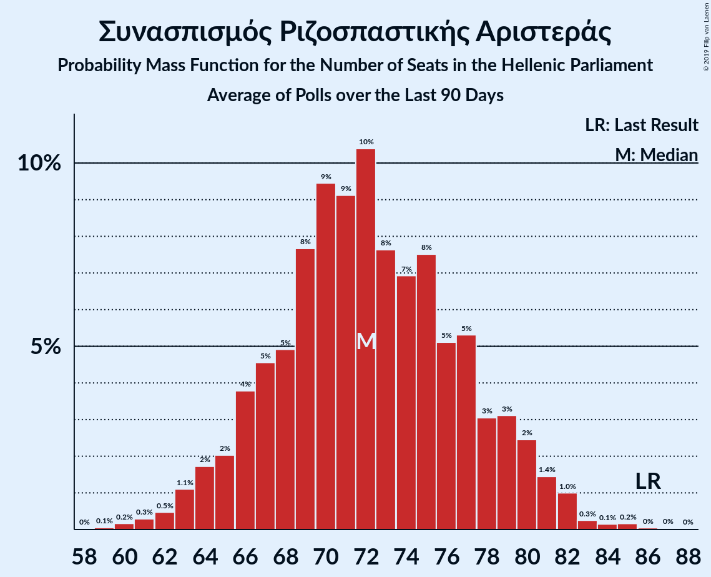

# Συνασπισμός Ριζοσπαστικής Αριστεράς

<a href="#voting-intentions">Voting Intentions</a> | <a href="#seats">Seats</a>

## Voting Intentions

Last result: **31.5%** (General Election of 7 July 2019)

### Confidence Intervals

| Period     | Polling firm/Commissioner(s) | Median | 80% Confidence Interval | 90% Confidence Interval | 95% Confidence Interval | 99% Confidence Interval |
|:----------:|:----------------:|:-----------:|:-----------------------:|:-----------------------:|:-----------------------:|:-----------------------:|
| N/A | [Poll Average](average.html) | 27.3% | 25.1–30.5% | 24.5–31.1% | 24.0–31.6% | 23.1–32.5% |
| [23–27 August 2021](2021-08-27-Interview.html) | Interview   Politic.gr | 25.4% | 23.9–27.0% | 23.5–27.5% | 23.2–27.9% | 22.5–28.6% |
| [20–25 August 2021](2021-08-25-GPO.html) | GPO   Τα Νέα | 28.4% | 26.6–30.3% | 26.1–30.8% | 25.7–31.3% | 24.8–32.2% |
| [23–24 August 2021](2021-08-24-Prorata.html) | Prorata   iEidiseis | 30.3% | 28.9–31.7% | 28.5–32.1% | 28.2–32.4% | 27.5–33.1% |
| [12–17 July 2021](2021-07-17-Alco.html) | Alco   Open TV | 27.2% | 25.5–29.1% | 25.0–29.6% | 24.5–30.1% | 23.7–31.0% |
| [7–11 July 2021](2021-07-11-Prorata.html) | Prorata | 29.3% | 27.9–30.7% | 27.5–31.1% | 27.2–31.5% | 26.5–32.2% |
| [7–10 July 2021](2021-07-10-GPO.html) | GPO   Powergame.gr | 28.5% | 26.7–30.4% | 26.2–30.9% | 25.8–31.4% | 25.0–32.3% |
| [27 June–7 July 2021](2021-07-07-PulseRC.html) | Pulse RC   ΣΚΑΪ | 26.4% | 25.3–27.5% | 25.0–27.8% | 24.7–28.1% | 24.2–28.7% |
| [30 June–7 July 2021](2021-07-07-OpinionPoll.html) | Opinion Poll   tomanifesto.gr | 25.8% | 24.1–27.7% | 23.6–28.2% | 23.2–28.7% | 22.4–29.6% |
| [23 June–1 July 2021](2021-07-01-MRB.html) | MRB | 28.3% | 27.0–29.6% | 26.7–30.0% | 26.4–30.3% | 25.8–31.0% |
| [26–29 June 2021](2021-06-29-GPO.html) | GPO   Τα Νέα | 28.4% | 26.6–30.3% | 26.1–30.8% | 25.7–31.3% | 24.8–32.2% |
| [18–24 June 2021](2021-06-24-Marc.html) | Marc   Πρώτο ΘΕΜΑ | 25.8% | 24.1–27.6% | 23.6–28.2% | 23.2–28.6% | 22.4–29.5% |
| [17–23 June 2021](2021-06-23-Interview.html) | Interview   Βεργίνα TV | 25.2% | 23.6–26.8% | 23.2–27.3% | 22.8–27.7% | 22.1–28.5% |
| [15–19 June 2021](2021-06-19-Alco.html) | Alco   Open TV | 28.1% | 26.3–30.0% | 25.8–30.5% | 25.4–31.0% | 24.6–31.9% |
| [3–5 June 2021](2021-06-05-GPO.html) | GPO   Powergame.gr | 27.8% | 26.0–29.7% | 25.5–30.2% | 25.1–30.7% | 24.3–31.6% |
| [31 May–2 June 2021](2021-06-02-PulseRC.html) | Pulse RC   ΣΚΑΪ | 27.0% | 25.5–28.6% | 25.0–29.1% | 24.6–29.5% | 23.9–30.3% |
| [18–28 May 2021](2021-05-28-OpinionPoll.html) | Opinion Poll | 24.8% | 23.4–26.2% | 23.1–26.6% | 22.7–27.0% | 22.1–27.7% |
| [18–24 May 2021](2021-05-24-MetronAnalysis.html) | Metron Analysis   Mega TV | 25.5% | N/A | N/A | N/A | N/A |
| [17–21 May 2021](2021-05-21-Alco.html) | Alco   Open TV | 27.9% | N/A | N/A | N/A | N/A |
| [11–17 May 2021](2021-05-17-Interview.html) | Interview   Βεργίνα TV | 24.4% | N/A | N/A | N/A | N/A |
| [5–7 May 2021](2021-05-07-GPO.html) | GPO   Powergame.gr | 27.3% | N/A | N/A | N/A | N/A |
| [22–27 April 2021](2021-04-27-Marc.html) | Marc   Πρώτο ΘΕΜΑ | 25.8% | N/A | N/A | N/A | N/A |
| [23–25 April 2021](2021-04-25-PulseRC.html) | Pulse RC   ΣΚΑΪ | 27.5% | N/A | N/A | N/A | N/A |
| [19–23 April 2021](2021-04-23-OpinionPoll.html) | Opinion Poll | 26.1% | N/A | N/A | N/A | N/A |
| [19–22 April 2021](2021-04-22-Interview.html) | Interview   Politic.gr | 25.5% | N/A | N/A | N/A | N/A |
| [13–19 April 2021](2021-04-19-Interview.html) | Interview   Βεργίνα TV | 25.3% | 23.7–27.0% | 23.2–27.5% | 22.8–27.9% | 22.1–28.8% |
| [12–16 April 2021](2021-04-16-Alco.html) | Alco   Open TV | 27.6% | 25.8–29.5% | 25.3–30.0% | 24.9–30.5% | 24.1–31.4% |
| [6–9 April 2021](2021-04-09-GPO.html) | GPO   Powergame.gr | 27.8% | N/A | N/A | N/A | N/A |
| [31 March–6 April 2021](2021-04-06-Prorata.html) | Prorata   Η Εφημερίδα των Συντακτών | 30.2% | N/A | N/A | N/A | N/A |
| [26–28 March 2021](2021-03-28-PulseRC.html) | Pulse RC   ΣΚΑΪ | 28.2% | N/A | N/A | N/A | N/A |
| [16–22 March 2021](2021-03-22-MetronAnalysis.html) | Metron Analysis   Mega TV | 27.5% | N/A | N/A | N/A | N/A |
| [19–22 March 2021](2021-03-22-Marc.html) | Marc   Alpha TV | 25.7% | 24.0–27.6% | 23.5–28.1% | 23.1–28.5% | 22.3–29.4% |
| [17–22 March 2021](2021-03-22-Interview.html) | Interview   Βεργίνα TV | 25.4% | N/A | N/A | N/A | N/A |
| [12–17 March 2021](2021-03-17-Alco.html) | Alco   Open TV | 26.7% | N/A | N/A | N/A | N/A |
| [3–5 March 2021](2021-03-05-GPO.html) | GPO   Powergame.gr | 27.2% | N/A | N/A | N/A | N/A |
| [1–3 March 2021](2021-03-03-MRB.html) | MRB   Star | 28.4% | 26.6–30.3% | 26.1–30.8% | 25.7–31.3% | 24.8–32.2% |
| [1–3 March 2021](2021-03-03-GPO.html) | GPO   Τα Νέα | 27.2% | N/A | N/A | N/A | N/A |
| [26–28 February 2021](2021-02-28-PulseRC.html) | Pulse RC   ΣΚΑΪ | 25.7% | N/A | N/A | N/A | N/A |
| [22–26 February 2021](2021-02-26-OpinionPoll.html) | Opinion Poll   Political | 25.1% | 23.4–26.9% | 22.9–27.4% | 22.5–27.9% | 21.7–28.7% |
| [14–22 February 2021](2021-02-22-Prorata.html) | Prorata   Η Εφημερίδα των Συντακτών | 30.3% | N/A | N/A | N/A | N/A |
| [15–19 February 2021](2021-02-19-OpinionPoll.html) | Opinion Poll | 25.1% | N/A | N/A | N/A | N/A |
| [15–18 February 2021](2021-02-18-Alco.html) | Alco   Open TV | 26.7% | N/A | N/A | N/A | N/A |
| [15–17 February 2021](2021-02-17-Interview.html) | Interview   Βεργίνα TV | 23.5% | N/A | N/A | N/A | N/A |
| [25–27 January 2021](2021-01-27-PulseRC.html) | Pulse RC   ΣΚΑΪ | 25.4% | N/A | N/A | N/A | N/A |
| [19–25 January 2021](2021-01-25-MetronAnalysis.html) | Metron Analysis   Mega TV | 25.3% | N/A | N/A | N/A | N/A |
| [19–20 January 2021](2021-01-20-GPO.html) | GPO   Παραπολιτικά | 27.6% | N/A | N/A | N/A | N/A |
| [14–19 January 2021](2021-01-19-Alco.html) | Alco   Open TV | 27.1% | 25.3–29.0% | 24.9–29.5% | 24.4–29.9% | 23.6–30.8% |
| [7–11 January 2021](2021-01-11-Marc.html) | Marc   Αlpha TV | 25.0% | 23.4–26.9% | 22.9–27.4% | 22.5–27.8% | 21.7–28.7% |
| [4–8 January 2021](2021-01-08-OpinionPoll.html) | Opinion Poll   Political | 26.5% | N/A | N/A | N/A | N/A |
| [12–16 December 2020](2020-12-16-PulseRC.html) | Pulse RC   ΣΚΑΪ | 26.6% | N/A | N/A | N/A | N/A |
| [27 November–11 December 2020](2020-12-11-MRB.html) | MRB   Star | 27.2% | N/A | N/A | N/A | N/A |
| [3–9 December 2020](2020-12-09-Alco.html) | Alco   Open TV | 26.2% | 24.5–28.0% | 24.0–28.6% | 23.6–29.0% | 22.8–29.9% |
| [3–7 December 2020](2020-12-07-Interview.html) | Interview   Political | 24.7% | N/A | N/A | N/A | N/A |
| [26 November–2 December 2020](2020-12-02-Interview.html) | Interview   Βεργίνα TV | 25.4% | 23.7–27.1% | 23.3–27.6% | 22.9–28.0% | 22.1–28.9% |
| [24–27 November 2020](2020-11-27-Prorata.html) | Prorata | 29.4% | 28.3–30.5% | 28.0–30.8% | 27.7–31.1% | 27.2–31.7% |
| [24–26 November 2020](2020-11-26-PulseRC.html) | Pulse RC   ΣΚΑΪ | 25.5% | 24.0–27.1% | 23.6–27.6% | 23.2–28.0% | 22.5–28.7% |
| [18–24 November 2020](2020-11-24-MetronAnalysis.html) | Metron Analysis   MEGA TV | 24.8% | 23.3–26.5% | 22.8–26.9% | 22.5–27.3% | 21.7–28.1% |
| [22–24 November 2020](2020-11-24-MRB.html) | MRB   Star | 27.1% | 25.3–28.9% | 24.8–29.5% | 24.4–29.9% | 23.6–30.8% |
| [17–19 November 2020](2020-11-19-ΚάπαResearch.html) | Κάπα Research | 28.6% | 26.8–30.4% | 26.3–30.9% | 25.9–31.4% | 25.1–32.3% |
| [10–13 November 2020](2020-11-13-GPO.html) | GPO   Παραπολιτικά | 28.9% | 27.1–30.8% | 26.6–31.3% | 26.2–31.8% | 25.3–32.7% |
| [4–11 November 2020](2020-11-11-OpinionPoll.html) | Opinion Poll | 24.4% | 22.7–26.2% | 22.2–26.7% | 21.8–27.2% | 21.0–28.0% |
| [6–11 November 2020](2020-11-11-Alco.html) | Alco   Open TV | 25.9% | 24.2–27.7% | 23.7–28.3% | 23.3–28.7% | 22.5–29.6% |
| [26–28 October 2020](2020-10-28-GPO.html) | GPO   Action24 | 28.1% | 26.3–30.0% | 25.8–30.5% | 25.4–31.0% | 24.6–31.9% |
| [18–22 October 2020](2020-10-22-PulseRC.html) | Pulse RC   ΣΚΑΪ | 25.5% | 23.8–27.3% | 23.3–27.8% | 22.9–28.3% | 22.1–29.2% |
| [16–21 October 2020](2020-10-21-Interview.html) | Interview   Βεργίνα TV | 22.1% | 20.6–23.7% | 20.2–24.2% | 19.8–24.6% | 19.2–25.4% |
| [11–15 October 2020](2020-10-15-OpinionPoll.html) | Opinion Poll | 23.8% | 22.1–25.6% | 21.7–26.1% | 21.3–26.6% | 20.5–27.4% |
| [10–14 October 2020](2020-10-14-Marc.html) | Marc   Αlpha TV | 24.3% | 22.6–26.1% | 22.2–26.6% | 21.8–27.1% | 21.0–28.0% |
| [6–10 October 2020](2020-10-10-Alco.html) | Alco   Open TV | 25.8% | 24.1–27.6% | 23.6–28.2% | 23.2–28.6% | 22.4–29.5% |
| [23–29 September 2020](2020-09-29-MetronAnalysis.html) | Metron Analysis   MEGA TV | 25.5% | 24.0–27.2% | 23.5–27.7% | 23.2–28.1% | 22.4–28.9% |
| [22–23 September 2020](2020-09-23-PulseRC.html) | Pulse RC   ΣΚΑΪ | 26.4% | 24.9–28.0% | 24.5–28.5% | 24.1–28.9% | 23.4–29.7% |
| [21–23 September 2020](2020-09-23-MRB.html) | MRB   Star | 25.8% | 24.1–27.6% | 23.6–28.1% | 23.2–28.6% | 22.4–29.4% |
| [21–23 September 2020](2020-09-23-Interview.html) | Interview   Βεργίνα TV | 22.9% | 21.4–24.6% | 20.9–25.1% | 20.5–25.5% | 19.8–26.3% |
| [14–16 September 2020](2020-09-16-GPO.html) | GPO   Παραπολιτικά | 26.8% | 25.1–28.7% | 24.6–29.2% | 24.1–29.6% | 23.3–30.5% |
| [14–16 September 2020](2020-09-16-Alco.html) | Alco   Open TV | 25.2% | 23.5–27.0% | 23.0–27.5% | 22.6–28.0% | 21.8–28.9% |
| [10–12 September 2020](2020-09-12-Marc.html) | Marc   Πρώτο ΘΕΜΑ | 24.6% | 23.2–26.1% | 22.9–26.5% | 22.5–26.9% | 21.9–27.6% |
| [7–10 September 2020](2020-09-10-OpinionPoll.html) | Opinion Poll | 24.7% | 23.0–26.5% | 22.5–27.0% | 22.1–27.4% | 21.3–28.3% |
| [30 August–2 September 2020](2020-09-02-GPO.html) | GPO   Τα Νέα | 26.7% | 25.0–28.6% | 24.5–29.1% | 24.1–29.5% | 23.2–30.4% |
| [13–15 July 2020](2020-07-15-Interview.html) | Interview   Βεργίνα TV | 24.1% | 22.5–25.8% | 22.1–26.3% | 21.7–26.7% | 20.9–27.5% |
| [10–13 July 2020](2020-07-13-Marc.html) | Marc   Αlpha TV | 24.6% | 22.9–26.4% | 22.5–26.9% | 22.1–27.4% | 21.3–28.2% |
| [6–8 July 2020](2020-07-08-PulseRC.html) | Pulse RC   ΣΚΑΪ | 26.0% | 24.5–27.6% | 24.0–28.0% | 23.7–28.4% | 23.0–29.2% |
| [29 June–4 July 2020](2020-07-04-Alco.html) | Alco   Open TV | 27.7% | 25.9–29.6% | 25.4–30.1% | 25.0–30.6% | 24.2–31.5% |
| [1–3 July 2020](2020-07-03-OpinionPoll.html) | Opinion Poll | 24.7% | 23.1–26.5% | 22.6–26.9% | 22.3–27.4% | 21.5–28.2% |
| [2 July 2020](2020-07-02-ΚάπαResearch.html) | Κάπα Research | 27.0% | 25.3–28.9% | 24.8–29.4% | 24.3–29.8% | 23.5–30.7% |
| [1–2 July 2020](2020-07-02-Marc.html) | Marc | 25.5% | 24.3–26.8% | 23.9–27.1% | 23.6–27.5% | 23.1–28.1% |
| [24–29 June 2020](2020-06-29-MetronAnalysis.html) | Metron Analysis   Το Βήμα | 25.8% | 24.3–27.3% | 23.9–27.8% | 23.5–28.2% | 22.9–28.9% |
| [22–26 June 2020](2020-06-26-Prorata.html) | Prorata | 28.5% | 27.3–29.8% | 26.9–30.1% | 26.6–30.4% | 26.1–31.0% |
| [22–26 June 2020](2020-06-26-GPO.html) | GPO   Τα Νέα | 26.0% | 24.6–27.5% | 24.2–27.9% | 23.8–28.3% | 23.2–29.0% |
| [17–25 June 2020](2020-06-25-MRB.html) | MRB   Star | 25.2% | 24.0–26.4% | 23.7–26.7% | 23.4–27.0% | 22.9–27.6% |
| [4–9 June 2020](2020-06-09-Interview.html) | Interview   Βεργίνα TV | 23.6% | 22.0–25.3% | 21.6–25.8% | 21.2–26.2% | 20.5–27.1% |
| [2–8 June 2020](2020-06-08-Alco.html) | Alco   Open TV | 26.8% | 25.1–28.7% | 24.6–29.2% | 24.1–29.6% | 23.3–30.5% |
| [1–3 June 2020](2020-06-03-PulseRC.html) | Pulse RC   ΣΚΑΪ | 26.0% | 24.4–27.7% | 24.0–28.1% | 23.6–28.5% | 22.8–29.4% |
| [1–3 June 2020](2020-06-03-OpinionPoll.html) | Opinion Poll   paraskhnio.gr | 24.3% | 22.7–26.1% | 22.2–26.6% | 21.8–27.0% | 21.1–27.9% |
| [22–27 May 2020](2020-05-27-MetronAnalysis.html) | Metron Analysis   MEGA TV | 25.7% | 24.2–27.4% | 23.7–27.9% | 23.3–28.3% | 22.6–29.1% |
| [22–27 May 2020](2020-05-27-GPO.html) | GPO   Παραπολιτικά | 24.1% | 22.4–25.9% | 21.9–26.4% | 21.6–26.9% | 20.8–27.7% |
| [8–13 May 2020](2020-05-13-MRB.html) | MRB   Star | 25.2% | 23.6–26.8% | 23.2–27.3% | 22.8–27.7% | 22.1–28.5% |
| [5–10 May 2020](2020-05-10-Alco.html) | Alco   Open TV | 26.1% | 24.4–27.9% | 23.9–28.5% | 23.5–28.9% | 22.7–29.8% |
| [7–9 May 2020](2020-05-09-OpinionPoll.html) | Opinion Poll | 25.1% | 23.5–26.8% | 23.0–27.3% | 22.6–27.8% | 21.8–28.6% |
| [4–6 May 2020](2020-05-06-PulseRC.html) | Pulse RC   ΣΚΑΪ | 25.0% | 23.5–26.7% | 23.0–27.1% | 22.6–27.6% | 21.9–28.3% |
| [3–6 May 2020](2020-05-06-Interview.html) | Interview   Βεργίνα TV | 23.1% | 21.5–24.8% | 21.1–25.2% | 20.7–25.7% | 20.0–26.5% |
| [24–29 April 2020](2020-04-29-Prorata.html) | Prorata | 28.0% | 26.9–29.2% | 26.6–29.5% | 26.3–29.8% | 25.7–30.4% |
| [22–28 April 2020](2020-04-28-MetronAnalysis.html) | Metron Analysis   MEGA TV | 25.4% | 23.9–27.1% | 23.4–27.5% | 23.0–28.0% | 22.3–28.8% |
| [14–22 April 2020](2020-04-22-GPO.html) | GPO   Παραπολιτικά | 25.8% | 24.1–27.6% | 23.6–28.2% | 23.2–28.6% | 22.4–29.5% |
| [15–17 April 2020](2020-04-17-ΚάπαResearch.html) | Κάπα Research   ΕΘΝΟΣ | 27.3% | 25.6–29.1% | 25.1–29.6% | 24.7–30.0% | 23.9–30.9% |
| [11–13 April 2020](2020-04-13-Marc.html) | Marc   Alpha TV | 24.5% | 22.8–26.3% | 22.4–26.8% | 22.0–27.3% | 21.2–28.1% |
| [30 March–1 April 2020](2020-04-01-PulseRC.html) | Pulse RC   ΣΚΑΪ | 24.5% | 23.0–26.1% | 22.5–26.6% | 22.2–26.9% | 21.5–27.7% |
| [23–26 March 2020](2020-03-26-OpinionPoll.html) | Opinion Poll   Πρώτο ΘΕΜΑ | 25.5% | 23.8–27.2% | 23.4–27.7% | 23.0–28.2% | 22.2–29.0% |
| [6–7 March 2020](2020-03-07-OpinionPoll.html) | Opinion Poll   Πρώτο ΘΕΜΑ | 26.1% | 24.5–27.8% | 24.1–28.2% | 23.7–28.7% | 22.9–29.5% |
| [2–7 March 2020](2020-03-07-Alco.html) | Alco   Open TV | 28.1% | 26.3–30.0% | 25.8–30.5% | 25.4–31.0% | 24.6–31.9% |
| [3–4 March 2020](2020-03-04-PulseRC.html) | Pulse RC   ΣΚΑΪ | 28.0% | 26.4–29.6% | 25.9–30.1% | 25.6–30.5% | 24.8–31.3% |
| [22–27 January 2020](2020-01-27-OpinionPoll.html) | Opinion Poll | 26.7% | 25.0–28.5% | 24.6–29.0% | 24.1–29.4% | 23.4–30.2% |
| [21–22 January 2020](2020-01-22-PulseRC.html) | Pulse RC   ΣΚΑΪ | 29.0% | 27.4–30.7% | 26.9–31.2% | 26.5–31.6% | 25.7–32.5% |
| [20–22 January 2020](2020-01-22-MetronAnalysis.html) | Metron Analysis   Το Βήμα | 26.8% | 25.2–28.5% | 24.7–28.9% | 24.3–29.4% | 23.6–30.2% |
| [13–17 January 2020](2020-01-17-MRB.html) | MRB   Star | 26.4% | 24.9–27.9% | 24.5–28.4% | 24.2–28.7% | 23.5–29.5% |
| [7–8 January 2020](2020-01-08-Interview.html) | Interview   Βεργίνα TV | 28.1% | 26.3–29.9% | 25.8–30.5% | 25.4–30.9% | 24.5–31.8% |
| [16–18 December 2019](2019-12-18-PulseRC.html) | Pulse RC   ΣΚΑΪ | 28.0% | 26.4–29.8% | 26.0–30.2% | 25.6–30.7% | 24.8–31.5% |
| [27 November–5 December 2019](2019-12-05-MRB.html) | MRB   Star | 27.6% | 26.3–28.9% | 26.0–29.3% | 25.7–29.6% | 25.1–30.2% |
| [25–28 November 2019](2019-11-28-OpinionPoll.html) | Opinion Poll | 27.8% | 26.1–29.6% | 25.6–30.1% | 25.2–30.6% | 24.4–31.5% |
| [18–20 November 2019](2019-11-20-ΜetronAnalysis.html) | Μetron Analysis   Το Βήμα | 25.7% | 24.1–27.4% | 23.7–27.8% | 23.3–28.2% | 22.6–29.1% |
| [18–20 November 2019](2019-11-20-PulseRC.html) | Pulse RC   ΣΚΑΪ | 27.6% | 26.0–29.3% | 25.5–29.8% | 25.1–30.2% | 24.4–31.0% |
| [11–14 November 2019](2019-11-14-PalmosAnalysis.html) | Palmos Analysis   GUE–NGL | 27.4% | 25.7–29.3% | 25.2–29.8% | 24.8–30.3% | 24.0–31.2% |
| [29–31 October 2019](2019-10-31-Marc.html) | Marc   Πρώτο ΘΕΜΑ | 27.5% | 25.8–29.4% | 25.3–29.9% | 24.8–30.4% | 24.0–31.3% |
| [22–23 October 2019](2019-10-23-PulseRC.html) | Pulse RC   ΣΚΑΪ | 28.5% | 26.8–30.3% | 26.3–30.8% | 25.9–31.2% | 25.1–32.1% |
| [16–18 September 2019](2019-09-18-ΜetronAnalysis.html) | Μetron Analysis   Το Βήμα | 26.8% | 25.2–28.5% | 24.7–29.0% | 24.4–29.4% | 23.6–30.2% |
| [17–18 September 2019](2019-09-18-PulseRC.html) | Pulse RC   ΣΚΑΪ | 29.5% | 27.7–31.3% | 27.3–31.8% | 26.8–32.2% | 26.0–33.1% |
| [14–16 September 2019](2019-09-16-MRB.html) | MRB   Star | 26.7% | 24.9–28.5% | 24.5–29.0% | 24.0–29.5% | 23.2–30.4% |
| [2–5 September 2019](2019-09-05-Marc.html) | Marc   Πρώτο ΘΕΜΑ | 28.2% | 26.4–30.1% | 25.9–30.6% | 25.5–31.0% | 24.6–32.0% |
| [2–4 September 2019](2019-09-04-OpinionPoll.html) | Opinion Poll | 26.6% | 24.9–28.3% | 24.5–28.9% | 24.1–29.3% | 23.3–30.1% |

### Probability Mass Function

The following table shows the probability mass function per percentage block of voting intentions for the [poll average](average.html) for Συνασπισμός Ριζοσπαστικής Αριστεράς.

| Voting Intentions | Probability | Accumulated | Special Marks |
|:-----------------:|:-----------:|:-----------:|:-------------:|
| 20.5–21.5% | 0% | 100% |  |
| 21.5–22.5% | 0.1% | 100% |  |
| 22.5–23.5% | 1.0% | 99.9% |  |
| 23.5–24.5% | 4% | 98.9% |  |
| 24.5–25.5% | 11% | 95% |  |
| 25.5–26.5% | 19% | 84% |  |
| 26.5–27.5% | 19% | 64% | Median |
| 27.5–28.5% | 13% | 45% |  |
| 28.5–29.5% | 12% | 32% |  |
| 29.5–30.5% | 11% | 20% |  |
| 30.5–31.5% | 7% | 10% |  |
| 31.5–32.5% | 2% | 3% | Last Result |
| 32.5–33.5% | 0.4% | 0.4% |  |
| 33.5–34.5% | 0% | 0% |  |

## Seats

Last result: **86** seats (General Election of 7 July 2019)

### Confidence Intervals

| Period     | Polling firm/Commissioner(s) | Median | 80% Confidence Interval | 90% Confidence Interval | 95% Confidence Interval | 99% Confidence Interval |
|:----------:|:----------------:|:------:|:-----------------------:|:-----------------------:|:-----------------------:|:-----------------------:|
| N/A | [Poll Average](average.html) | 75 | 69–86 | 68–88 | 67–90 | 65–92 |
| [23–27 August 2021](2021-08-27-Interview.html) | Interview   Politic.gr | 73 | 68–76 | 67–77 | 67–78 | 64–82 |
| [20–25 August 2021](2021-08-25-GPO.html) | GPO   Τα Νέα | 78 | 73–83 | 71–85 | 70–86 | 68–88 |
| [23–24 August 2021](2021-08-24-Prorata.html) | Prorata   iEidiseis | 86 | 83–90 | 81–90 | 80–92 | 78–94 |
| [12–17 July 2021](2021-07-17-Alco.html) | Alco   Open TV | 73 | 69–78 | 67–80 | 66–81 | 64–83 |
| [7–11 July 2021](2021-07-11-Prorata.html) | Prorata | 82 | 78–87 | 77–88 | 76–89 | 74–91 |
| [7–10 July 2021](2021-07-10-GPO.html) | GPO   Powergame.gr | 76 | 71–81 | 70–83 | 69–84 | 66–86 |
| [27 June–7 July 2021](2021-07-07-PulseRC.html) | Pulse RC   ΣΚΑΪ | 72 | 69–75 | 69–76 | 68–77 | 66–78 |
| [30 June–7 July 2021](2021-07-07-OpinionPoll.html) | Opinion Poll   tomanifesto.gr | 68 | 63–73 | 62–74 | 61–75 | 59–78 |
| [23 June–1 July 2021](2021-07-01-MRB.html) | MRB | 75 | 72–79 | 71–80 | 70–81 | 68–82 |
| [26–29 June 2021](2021-06-29-GPO.html) | GPO   Τα Νέα | 75 | 71–80 | 69–82 | 68–83 | 66–85 |
| [18–24 June 2021](2021-06-24-Marc.html) | Marc   Πρώτο ΘΕΜΑ | 69 | 64–73 | 63–75 | 62–76 | 59–79 |
| [17–23 June 2021](2021-06-23-Interview.html) | Interview   Βεργίνα TV | 69 | 65–74 | 64–75 | 63–76 | 61–78 |
| [15–19 June 2021](2021-06-19-Alco.html) | Alco   Open TV | 75 | 70–79 | 68–81 | 67–82 | 65–85 |
| [3–5 June 2021](2021-06-05-GPO.html) | GPO   Powergame.gr | 73 | 69–79 | 67–80 | 67–82 | 64–84 |
| [31 May–2 June 2021](2021-06-02-PulseRC.html) | Pulse RC   ΣΚΑΪ | 73 | 69–78 | 69–78 | 68–81 | 65–82 |
| [18–28 May 2021](2021-05-28-OpinionPoll.html) | Opinion Poll | 66 | 66 | 66 | 66 | 66 |
| [18–24 May 2021](2021-05-24-MetronAnalysis.html) | Metron Analysis   Mega TV |  |  |  |  |  |
| [17–21 May 2021](2021-05-21-Alco.html) | Alco   Open TV |  |  |  |  |  |
| [11–17 May 2021](2021-05-17-Interview.html) | Interview   Βεργίνα TV |  |  |  |  |  |
| [5–7 May 2021](2021-05-07-GPO.html) | GPO   Powergame.gr |  |  |  |  |  |
| [22–27 April 2021](2021-04-27-Marc.html) | Marc   Πρώτο ΘΕΜΑ |  |  |  |  |  |
| [23–25 April 2021](2021-04-25-PulseRC.html) | Pulse RC   ΣΚΑΪ |  |  |  |  |  |
| [19–23 April 2021](2021-04-23-OpinionPoll.html) | Opinion Poll |  |  |  |  |  |
| [19–22 April 2021](2021-04-22-Interview.html) | Interview   Politic.gr |  |  |  |  |  |
| [13–19 April 2021](2021-04-19-Interview.html) | Interview   Βεργίνα TV | 69 | 65–74 | 63–75 | 62–76 | 60–79 |
| [12–16 April 2021](2021-04-16-Alco.html) | Alco   Open TV | 75 | 70–80 | 68–81 | 67–83 | 65–85 |
| [6–9 April 2021](2021-04-09-GPO.html) | GPO   Powergame.gr |  |  |  |  |  |
| [31 March–6 April 2021](2021-04-06-Prorata.html) | Prorata   Η Εφημερίδα των Συντακτών |  |  |  |  |  |
| [26–28 March 2021](2021-03-28-PulseRC.html) | Pulse RC   ΣΚΑΪ |  |  |  |  |  |
| [16–22 March 2021](2021-03-22-MetronAnalysis.html) | Metron Analysis   Mega TV |  |  |  |  |  |
| [19–22 March 2021](2021-03-22-Marc.html) | Marc   Alpha TV | 68 | 64–73 | 62–75 | 61–76 | 59–79 |
| [17–22 March 2021](2021-03-22-Interview.html) | Interview   Βεργίνα TV |  |  |  |  |  |
| [12–17 March 2021](2021-03-17-Alco.html) | Alco   Open TV |  |  |  |  |  |
| [3–5 March 2021](2021-03-05-GPO.html) | GPO   Powergame.gr |  |  |  |  |  |
| [1–3 March 2021](2021-03-03-MRB.html) | MRB   Star | 73 | 69–78 | 68–80 | 66–81 | 64–83 |
| [1–3 March 2021](2021-03-03-GPO.html) | GPO   Τα Νέα |  |  |  |  |  |
| [26–28 February 2021](2021-02-28-PulseRC.html) | Pulse RC   ΣΚΑΪ |  |  |  |  |  |
| [22–26 February 2021](2021-02-26-OpinionPoll.html) | Opinion Poll   Political | 66 | 61–71 | 60–72 | 59–73 | 57–76 |
| [14–22 February 2021](2021-02-22-Prorata.html) | Prorata   Η Εφημερίδα των Συντακτών |  |  |  |  |  |
| [15–19 February 2021](2021-02-19-OpinionPoll.html) | Opinion Poll |  |  |  |  |  |
| [15–18 February 2021](2021-02-18-Alco.html) | Alco   Open TV |  |  |  |  |  |
| [15–17 February 2021](2021-02-17-Interview.html) | Interview   Βεργίνα TV |  |  |  |  |  |
| [25–27 January 2021](2021-01-27-PulseRC.html) | Pulse RC   ΣΚΑΪ |  |  |  |  |  |
| [19–25 January 2021](2021-01-25-MetronAnalysis.html) | Metron Analysis   Mega TV |  |  |  |  |  |
| [19–20 January 2021](2021-01-20-GPO.html) | GPO   Παραπολιτικά |  |  |  |  |  |
| [14–19 January 2021](2021-01-19-Alco.html) | Alco   Open TV | 74 | 69–79 | 68–81 | 66–82 | 64–85 |
| [7–11 January 2021](2021-01-11-Marc.html) | Marc   Αlpha TV | 67 | 62–72 | 61–73 | 60–75 | 58–77 |
| [4–8 January 2021](2021-01-08-OpinionPoll.html) | Opinion Poll   Political |  |  |  |  |  |
| [12–16 December 2020](2020-12-16-PulseRC.html) | Pulse RC   ΣΚΑΪ |  |  |  |  |  |
| [27 November–11 December 2020](2020-12-11-MRB.html) | MRB   Star |  |  |  |  |  |
| [3–9 December 2020](2020-12-09-Alco.html) | Alco   Open TV | 71 | 65–75 | 64–77 | 63–78 | 61–81 |
| [3–7 December 2020](2020-12-07-Interview.html) | Interview   Political |  |  |  |  |  |
| [26 November–2 December 2020](2020-12-02-Interview.html) | Interview   Βεργίνα TV | 69 | 64–74 | 63–75 | 62–76 | 60–79 |
| [24–27 November 2020](2020-11-27-Prorata.html) | Prorata | 79 | 76–83 | 75–84 | 75–84 | 73–86 |
| [24–26 November 2020](2020-11-26-PulseRC.html) | Pulse RC   ΣΚΑΪ | 69 | 65–73 | 63–74 | 62–76 | 61–78 |
| [18–24 November 2020](2020-11-24-MetronAnalysis.html) | Metron Analysis   MEGA TV | 66 | 62–70 | 61–71 | 60–72 | 58–75 |
| [22–24 November 2020](2020-11-24-MRB.html) | MRB   Star | 71 | 66–76 | 65–78 | 64–79 | 62–81 |
| [17–19 November 2020](2020-11-19-ΚάπαResearch.html) | Κάπα Research | 75 | 70–80 | 69–81 | 68–83 | 66–85 |
| [10–13 November 2020](2020-11-13-GPO.html) | GPO   Παραπολιτικά | 78 | 73–83 | 72–84 | 70–86 | 68–88 |
| [4–11 November 2020](2020-11-11-OpinionPoll.html) | Opinion Poll | 64 | 59–69 | 58–70 | 57–71 | 55–74 |
| [6–11 November 2020](2020-11-11-Alco.html) | Alco   Open TV | 71 | 66–77 | 65–78 | 64–79 | 61–82 |
| [26–28 October 2020](2020-10-28-GPO.html) | GPO   Action24 | 75 | 70–80 | 68–82 | 67–83 | 65–86 |
| [18–22 October 2020](2020-10-22-PulseRC.html) | Pulse RC   ΣΚΑΪ | 69 | 64–74 | 63–76 | 62–77 | 60–79 |
| [16–21 October 2020](2020-10-21-Interview.html) | Interview   Βεργίνα TV | 61 | 57–66 | 56–67 | 55–68 | 53–70 |
| [11–15 October 2020](2020-10-15-OpinionPoll.html) | Opinion Poll | 61 | 57–66 | 56–67 | 55–68 | 53–71 |
| [10–14 October 2020](2020-10-14-Marc.html) | Marc   Αlpha TV | 65 | 60–70 | 59–71 | 58–72 | 55–75 |
| [6–10 October 2020](2020-10-10-Alco.html) | Alco   Open TV | 72 | 69–75 | 68–76 | 66–76 | 60–78 |
| [23–29 September 2020](2020-09-29-MetronAnalysis.html) | Metron Analysis   MEGA TV | 67 | 63–72 | 62–73 | 61–74 | 59–76 |
| [22–23 September 2020](2020-09-23-PulseRC.html) | Pulse RC   ΣΚΑΪ | 72 | 68–77 | 66–78 | 65–79 | 63–81 |
| [21–23 September 2020](2020-09-23-MRB.html) | MRB   Star | 68 | 64–73 | 62–75 | 61–76 | 59–78 |
| [21–23 September 2020](2020-09-23-Interview.html) | Interview   Βεργίνα TV | 63 | 59–68 | 58–69 | 57–70 | 55–73 |
| [14–16 September 2020](2020-09-16-GPO.html) | GPO   Παραπολιτικά | 71 | 66–76 | 65–78 | 64–79 | 61–82 |
| [14–16 September 2020](2020-09-16-Alco.html) | Alco   Open TV | 69 | 64–74 | 63–75 | 61–76 | 59–79 |
| [10–12 September 2020](2020-09-12-Marc.html) | Marc   Πρώτο ΘΕΜΑ | 67 | 63–71 | 62–72 | 61–73 | 59–75 |
| [7–10 September 2020](2020-09-10-OpinionPoll.html) | Opinion Poll | 65 | 60–70 | 59–72 | 58–73 | 56–76 |
| [30 August–2 September 2020](2020-09-02-GPO.html) | GPO   Τα Νέα | 71 | 66–76 | 65–77 | 63–79 | 61–81 |
| [13–15 July 2020](2020-07-15-Interview.html) | Interview   Βεργίνα TV | 64 | 60–69 | 59–71 | 58–72 | 56–74 |
| [10–13 July 2020](2020-07-13-Marc.html) | Marc   Αlpha TV | 67 | 62–72 | 61–73 | 60–74 | 58–77 |
| [6–8 July 2020](2020-07-08-PulseRC.html) | Pulse RC   ΣΚΑΪ | 71 | 67–76 | 65–77 | 64–78 | 62–81 |
| [29 June–4 July 2020](2020-07-04-Alco.html) | Alco   Open TV | 74 | 69–79 | 68–81 | 66–82 | 64–85 |
| [1–3 July 2020](2020-07-03-OpinionPoll.html) | Opinion Poll | 66 | 62–71 | 61–73 | 60–75 | 57–77 |
| [2 July 2020](2020-07-02-ΚάπαResearch.html) | Κάπα Research | 73 | 68–79 | 67–80 | 66–82 | 63–85 |
| [1–2 July 2020](2020-07-02-Marc.html) | Marc | 67 | 63–70 | 62–71 | 62–72 | 60–74 |
| [24–29 June 2020](2020-06-29-MetronAnalysis.html) | Metron Analysis   Το Βήμα | 65 | 62–69 | 60–70 | 60–71 | 58–73 |
| [22–26 June 2020](2020-06-26-Prorata.html) | Prorata | 79 | 75–83 | 74–84 | 73–85 | 71–87 |
| [22–26 June 2020](2020-06-26-GPO.html) | GPO   Τα Νέα | 68 | 64–72 | 63–73 | 62–74 | 60–76 |
| [17–25 June 2020](2020-06-25-MRB.html) | MRB   Star | 68 | 65–72 | 64–73 | 63–74 | 62–76 |
| [4–9 June 2020](2020-06-09-Interview.html) | Interview   Βεργίνα TV | 64 | 60–68 | 58–70 | 57–71 | 55–73 |
| [2–8 June 2020](2020-06-08-Alco.html) | Alco   Open TV | 72 | 68–78 | 66–79 | 65–80 | 63–83 |
| [1–3 June 2020](2020-06-03-PulseRC.html) | Pulse RC   ΣΚΑΪ | 70 | 65–74 | 64–76 | 63–77 | 61–80 |
| [1–3 June 2020](2020-06-03-OpinionPoll.html) | Opinion Poll   paraskhnio.gr | 64 | 59–68 | 58–70 | 57–71 | 55–73 |
| [22–27 May 2020](2020-05-27-MetronAnalysis.html) | Metron Analysis   MEGA TV | 70 | 65–75 | 64–76 | 63–78 | 61–80 |
| [22–27 May 2020](2020-05-27-GPO.html) | GPO   Παραπολιτικά | 64 | 59–68 | 58–70 | 57–71 | 54–73 |
| [8–13 May 2020](2020-05-13-MRB.html) | MRB   Star | 66 | 62–71 | 61–72 | 60–73 | 58–75 |
| [5–10 May 2020](2020-05-10-Alco.html) | Alco   Open TV | 73 | 65–78 | 63–79 | 62–80 | 60–82 |
| [7–9 May 2020](2020-05-09-OpinionPoll.html) | Opinion Poll | 66 | 61–69 | 60–71 | 59–72 | 56–74 |
| [4–6 May 2020](2020-05-06-PulseRC.html) | Pulse RC   ΣΚΑΪ | 68 | 63–72 | 62–74 | 61–75 | 59–77 |
| [3–6 May 2020](2020-05-06-Interview.html) | Interview   Βεργίνα TV | 62 | 58–67 | 56–68 | 55–69 | 53–72 |
| [24–29 April 2020](2020-04-29-Prorata.html) | Prorata | 76 | 72–79 | 71–80 | 70–81 | 69–83 |
| [22–28 April 2020](2020-04-28-MetronAnalysis.html) | Metron Analysis   MEGA TV | 68 | 63–72 | 62–74 | 61–75 | 59–77 |
| [14–22 April 2020](2020-04-22-GPO.html) | GPO   Παραπολιτικά | 68 | 63–73 | 62–74 | 60–75 | 58–78 |
| [15–17 April 2020](2020-04-17-ΚάπαResearch.html) | Κάπα Research   ΕΘΝΟΣ | 73 | 68–78 | 66–79 | 65–80 | 63–83 |
| [11–13 April 2020](2020-04-13-Marc.html) | Marc   Alpha TV | 65 | 61–70 | 59–72 | 58–73 | 56–75 |
| [30 March–1 April 2020](2020-04-01-PulseRC.html) | Pulse RC   ΣΚΑΪ | 66 | 61–70 | 60–72 | 59–73 | 57–75 |
| [23–26 March 2020](2020-03-26-OpinionPoll.html) | Opinion Poll   Πρώτο ΘΕΜΑ | 67 | 62–71 | 61–72 | 60–74 | 58–76 |
| [6–7 March 2020](2020-03-07-OpinionPoll.html) | Opinion Poll   Πρώτο ΘΕΜΑ | 68 | 64–73 | 63–74 | 62–75 | 60–78 |
| [2–7 March 2020](2020-03-07-Alco.html) | Alco   Open TV | 73 | 68–78 | 66–80 | 65–81 | 63–83 |
| [3–4 March 2020](2020-03-04-PulseRC.html) | Pulse RC   ΣΚΑΪ | 76 | 71–80 | 70–82 | 69–83 | 67–85 |
| [22–27 January 2020](2020-01-27-OpinionPoll.html) | Opinion Poll | 70 | 66–75 | 64–76 | 63–78 | 61–80 |
| [21–22 January 2020](2020-01-22-PulseRC.html) | Pulse RC   ΣΚΑΪ | 78 | 73–82 | 72–84 | 71–85 | 69–88 |
| [20–22 January 2020](2020-01-22-MetronAnalysis.html) | Metron Analysis   Το Βήμα | 71 | 65–73 | 64–74 | 63–75 | 62–79 |
| [13–17 January 2020](2020-01-17-MRB.html) | MRB   Star | 71 | 67–75 | 66–76 | 65–77 | 63–79 |
| [7–8 January 2020](2020-01-08-Interview.html) | Interview   Βεργίνα TV | 76 | 71–81 | 70–83 | 68–83 | 66–86 |
| [16–18 December 2019](2019-12-18-PulseRC.html) | Pulse RC   ΣΚΑΪ | 75 | 71–80 | 69–81 | 68–83 | 66–85 |
| [27 November–5 December 2019](2019-12-05-MRB.html) | MRB   Star | 73 | 70–77 | 69–78 | 68–79 | 66–81 |
| [25–28 November 2019](2019-11-28-OpinionPoll.html) | Opinion Poll | 71 | 66–75 | 65–77 | 64–78 | 62–80 |
| [18–20 November 2019](2019-11-20-ΜetronAnalysis.html) | Μetron Analysis   Το Βήμα | 68 | 64–72 | 63–74 | 62–75 | 60–77 |
| [18–20 November 2019](2019-11-20-PulseRC.html) | Pulse RC   ΣΚΑΪ | 74 | 70–78 | 68–80 | 67–81 | 65–83 |
| [11–14 November 2019](2019-11-14-PalmosAnalysis.html) | Palmos Analysis   GUE–NGL | 75 | 69–80 | 68–81 | 67–83 | 64–85 |
| [29–31 October 2019](2019-10-31-Marc.html) | Marc   Πρώτο ΘΕΜΑ | 73 | 69–79 | 67–80 | 66–82 | 63–84 |
| [22–23 October 2019](2019-10-23-PulseRC.html) | Pulse RC   ΣΚΑΪ | 76 | 71–80 | 70–82 | 69–83 | 67–86 |
| [16–18 September 2019](2019-09-18-ΜetronAnalysis.html) | Μetron Analysis   Το Βήμα | 70 | 66–75 | 65–76 | 64–77 | 62–79 |
| [17–18 September 2019](2019-09-18-PulseRC.html) | Pulse RC   ΣΚΑΪ | 78 | 74–83 | 72–85 | 71–86 | 69–89 |
| [14–16 September 2019](2019-09-16-MRB.html) | MRB   Star | 70 | 66–76 | 65–77 | 65–78 | 62–81 |
| [2–5 September 2019](2019-09-05-Marc.html) | Marc   Πρώτο ΘΕΜΑ | 76 | 71–82 | 69–83 | 68–85 | 66–87 |
| [2–4 September 2019](2019-09-04-OpinionPoll.html) | Opinion Poll | 71 | 66–76 | 65–77 | 63–78 | 62–81 |

### Probability Mass Function

The following table shows the probability mass function per seat for the [poll average](average.html) for Συνασπισμός Ριζοσπαστικής Αριστεράς.

| Number of Seats | Probability | Accumulated | Special Marks |
|:---------------:|:-----------:|:-----------:|:-------------:|
| 62 | 0% | 100% |  |
| 63 | 0.1% | 99.9% |  |
| 64 | 0.2% | 99.8% |  |
| 65 | 0.3% | 99.7% |  |
| 66 | 0.6% | 99.4% |  |
| 67 | 2% | 98.8% |  |
| 68 | 3% | 97% |  |
| 69 | 5% | 94% |  |
| 70 | 6% | 89% |  |
| 71 | 6% | 83% |  |
| 72 | 7% | 76% |  |
| 73 | 8% | 69% |  |
| 74 | 6% | 61% |  |
| 75 | 8% | 55% | Median |
| 76 | 6% | 47% |  |
| 77 | 5% | 40% |  |
| 78 | 4% | 36% |  |
| 79 | 4% | 32% |  |
| 80 | 2% | 29% |  |
| 81 | 4% | 26% |  |
| 82 | 1.2% | 22% |  |
| 83 | 3% | 21% |  |
| 84 | 2% | 17% |  |
| 85 | 4% | 15% |  |
| 86 | 3% | 11% | Last Result |
| 87 | 2% | 8% |  |
| 88 | 2% | 6% |  |
| 89 | 1.0% | 4% |  |
| 90 | 2% | 3% |  |
| 91 | 0.2% | 1.0% |  |
| 92 | 0.6% | 0.8% |  |
| 93 | 0.1% | 0.2% |  |
| 94 | 0.1% | 0.1% |  |
| 95 | 0% | 0% |  |

